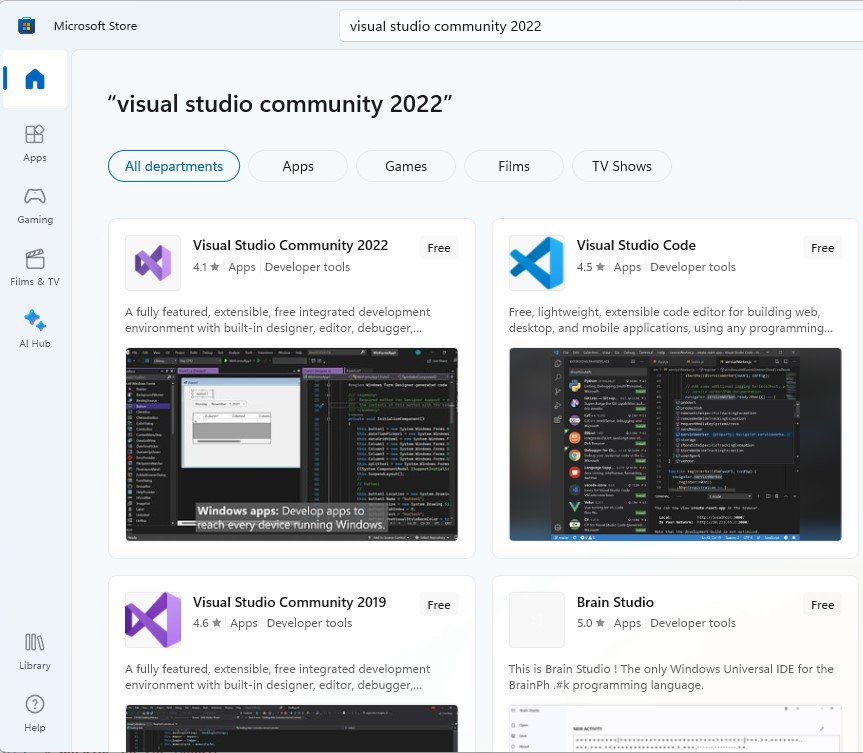
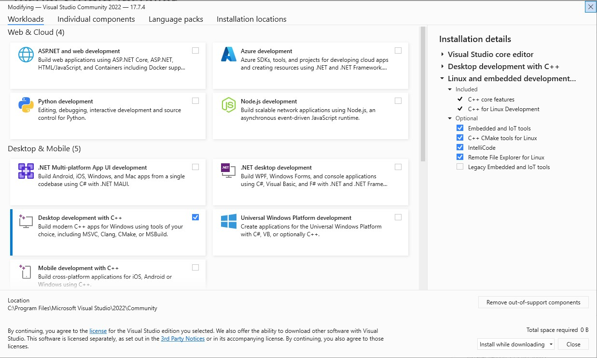

# Introduction

In this section, we are concerned with setting up our computer, and using the development tools needed for this course.

The choice of tool is discussed so that by the end of this section, as well as learning to use the tools, hopefully you will also begin to be able to *select appropriate software development tools, techniques and environments to aid the implementation of simple software.*

## Aims:

The aims of this section are as follows:

* Install the development tools
* Building and running some code
* Debugging 
* Version control to manage changes
* Appreciate the rationale for using specific tools

## Table of Contents

## Choice of Software

This course is aimed at beginners, and uses Visual Studio Community Edition running on Microsoft Windows 10 or 11 as a host operating system. Screenshots will differ from the Mac version of Visual Studio. The focus is on programming however, so beyond initial setup, it will make little difference. Some material has been provided to support setting up and use of Visual Studio Code (for those on Mac OS or Linux).

> Subsequent modules will also be using Visual Studio (for Windows). If you do venture in a different direction, please ensure you are comfortable using Visual Studio (it is on all our lab machines).

Part of computer science is choosing the right tools. Below is a description of *some* of the choices available to us. This is a small subset from the tools we sometimes use, and many others are available.

| Item | Name | Description |
| - | - | - |
| 1. | **I**ntegrated **D**evelopment **E**nvironment (**IDE**) | This is a software tool that allows us to write source code, build executable programs and test |
| | [Visual Studio](https://visualstudio.microsoft.com/downloads/) | A complete developer tool that supports multiple languages and frameworks. It is suitable for beginners and experts. It is available for MS Windows and Mac OS (although Mac support is being dropped). Developers can select different options depending on needs. Visual Studio can occupy a considerable amount of disk space, especially if support for a lot of frameworks is needed. It also supports a plug-in architecture to allow it to be extended. Visual studio community edition is free for individuals. |
| | [Visual Studio Code](https://code.visualstudio.com/) | This is a free and and open-source cross-platform text editor with a rich plug-in ecosystem. Increasingly it is used as a full IDE. Configuration is not as simple as Visual Studio, and may not always be the best choice for beginners. However, it is available for Windows, Linux (inc. Raspberry Pi), Mac OS and [Web](https://vscode.dev/) |
| 2. Build Tools | [Microsoft C/C++ Compiler](https://visualstudio.microsoft.com/downloads/#build-tools-for-visual-studio-2022) | This is the tool that converts your code into binary code that a computer understands. The Microsoft Compiler can be installed as part of Visual Studio, or as a separate standalone package. Again, free for individual use. It is maybe important to note that an IDE and build tools are separate entities. The IDE allows to the user to edit software source code and interact with the built tools in a more user friendly way. |
| | open source (gcc) | A popular option for those who need to build software with maximum compatibility with Linux. A popular system is [msys2](https://www.msys2.org/) which includes support for multiple languages. This may not be the best choice for beginners, and does come with some additional complexity. It is of course free. Another option is to use [WSL2](https://learn.microsoft.com/windows/wsl/install), which is now part of Microsoft Windows. This gets you a full virtual Linux based environment capable of running both command-line and graphical apps. |

Beyond this course, choice of tools can be confusing. The term "curse of choice" is sometimes used to describe this. Often it will depend on what others around you are using and the support that provides.

Increasingly, software is written to execute in a "headless" environment, that is, one without a screen, mouse or keyboard. This includes the following use cases:

* Continuous Integration - tools used to verify, validate and even deploy software as it is built.

* Embedded / Internet of Things (IoT) - There is a vast market of electronic devices running software, spanning many sectors, including consumer devices, kiosks and commercial jet dashboards and control systems. Such software runs on a diverse variety of hardware, often with limited computing resources. To maximize use of resources, much of this is written in C or C++.

* Server Side Code - The World Wide Web is, in part, built from a vast interconnected network of computers, known as servers. When a resource is requested (such as a web page), code will run on that machine. 

There may be times when a developer only wishes to remotely connect to such a system to modify / debug some software. Sometimes they may choose to only use a text editor and a compiler on the live system. This can actually be simpler, *once* you know how of course.

Many open source tools are designed to be build from the *command line*, and do not require the installation of an IDE. This can become complex, and may use tools such as `make` or `cmake` to manage this in a scripted environment. It is often the case that an IDE will also leverage such tools, but offers are more user friendly experience.

Choice of tool depends on experience, environment, budget, language and available expertise. Personal preference can be a factor, but equally, so can company culture and expectation to work with others. 

### Some Perspective 

We want to keep things simple to we can focus on learning to program. Finding the perfect tool set can easily become a distraction. We would encourage students to explore the different options out there. However, this should not be at the expense of working on the assessed aspects of this course.

> Remember - we don't want to spend all our time sharpening our pencils. We also need to write something!

# Working from Home

There is a significant amount of self-study time allocated to every module. It is unlikely that all students will complete labs in the allocated lab time.

> Think of lab time as the opportunity to ask questions rather than finish everything.

So for that, we first discuss installing software on your own computer. If you plan to only use University computers, you can skip this step.

## Setting up Visual Studio

To install Visual Studio on Windows, the following video should help guide you through the process.

| TASK | Watch Video on Installing Visual Studio on Windows 10/11 |
| - | - |
| | https://plymouth.cloud.panopto.eu/Panopto/Pages/Viewer.aspx?id=f183646b-c398-4d25-9036-b08500fd7f09&instance=dle |
| | |

For Microsoft Windows 10 and 11 users, Visual Studio is available in the Microsoft Store (See image below).

<figure>

<figcaption>Visual Studio Community Edition 2022 in the Microsoft Store</figcaption>
</figure>

You can also download it for both Mac and Windows  via the following URLs:

https://visualstudio.microsoft.com/downloads/

Visual Studio is designed to enable development of many different project types, in different languages. To install everything would unnecessarily consume a large amount of disk space. Therefore, different project types are partitioned into "workflows".

Once you have installed it, you will likely be asked to install some "workflows".

### Installation Options

After Visual Studio installs, you will probably be presented with a window that looks similar to the image below:

<figure>

<figcaption>Visual Studio Community Edition 2022 Workloads Dialog</figcaption>
</figure>

We will be needing the **Desktop development with C++** workload. Select this option and click install. This will download and install more files.

## Setting up Visual Studio Code (alternative)

If you wish to Visual Studio Code, it is available for Windows, Mac OS and Linux (including Raspberry Pi). Use the same links as above.

However, installing the requirements for C++ development is more involved. You will need the following:

* C++ Compiler
* C++ Extensions for Visual Studio Code

### Install build tools and extensions

The Microsoft C++ Compiler (for MS Windows) is available as a separate installer.

https://visualstudio.microsoft.com/downloads/

Scroll down, expand the section "Tools for Visual Studio" and download "Build Tools for Visual Studio 2022"

When you run Visual Studio Code, you will need to install the C/C++ extension from Microsoft.

* Go to the extensions tab and search C++. 
* Select and install the C/C++ extension from Microsoft
* You may also want to install the C/C++ Extension Pack from Microsoft for more advanced options

Instructions are provided here https://code.visualstudio.com/docs/cpp/config-msvc

**Note that using Visual Studio Code is an advanced option, and you will need to support yourself**.

## Mac Users

For 2023, we recommend Mac users install Visual Studio for Mac OS.

Visual Studio Code is another option.

An interesting alternative for Mac users is to install the much respected XCode IDE and command line tools. This has excellent support for the C and C++ languages. Again, we cannot support this, but it is an option if you might want to explore.

## Git and Github

All students will need to install git and GitHub Desktop.

* The official site for the git version control system is here https://git-scm.com/

* GitHub Desktop is an excellent cross platform tool, and is available from https://desktop.github.com. Linux users can obtain it from here: https://github.com/shiftkey/desktop/releases

| TASK | Create GitHub account |
| - | - |
| 1. | Go to the [GitHub](https://github.com/) site and create an account |
| 2. | Sign up for the [student starter pack](https://education.github.com/pack) |

Now run GitHub desktop and sign in with your GitHub credentials. You will need this for your coursework

# Working on the Module

Whether at home on in the lab, we now start our first task, and that is to write our first application!

## Writing your first application (Visual Studio)

Now Visual Studio is installed, please do the following:

| Task | Writing your first application |
| - | - |
| 1. | [Watch this video](https://plymouth.cloud.panopto.eu/Panopto/Pages/Viewer.aspx?id=95a8c080-dc00-4f79-b108-b08500fe68f2&instance=dle) |
| 2. | Replicate what you see in the video on the computer you are using |

Remember:

* **NEVER** put your code files in a folder managed by a cloud sync tool (e.g. OneDrive, DropBox, iCloudDrive)

## Debugging your first application (Visual Studio)

Again a video has been prepared to help you use the debugger for the first time.

| TASK | Debugging in Visual Studio |
| - | - |
| 1. | [Watch this video](https://plymouth.cloud.panopto.eu/Panopto/Pages/Viewer.aspx?id=d4a3fe33-e7e8-4a62-b767-b08501008c07&instance=dle) |#
| 2. | Replicate what you see in the video on the computer you are using |

## Wring and debugging your first application (Visual Studio Code)

Although flexible, powerful and cross platform, Visual Studio Code is a more advanced tool. For those interested in using it, the following video has been prepared:

https://plymouth.cloud.panopto.eu/Panopto/Pages/Viewer.aspx?id=f8f7f6f2-8d25-4259-ad49-b08900ca2d99

For more advanced debugging, maybe watch the following if you are interested:

https://plymouth.cloud.panopto.eu/Panopto/Pages/Viewer.aspx?id=17c13ddd-0f2e-4dc3-9487-b08900ccfaeb

## Building from the command line (Windows)

Once you have installed Visual Studio (or the Microsoft Build Tools), you should be able to build software from the command line. This is sometimes a useful thing to know as ultimately, this is what tools such as Visual Studio do for you.

| TASK | Building from the Command Line |
| - | -| 
| 1. | Watch [this video](https://plymouth.cloud.panopto.eu/Panopto/Pages/Viewer.aspx?id=02759f6f-899e-4fd3-a31f-b08900d18e19) |
| 2. | See if you can reproduce what was done on the computer you are using |
| 3. | Add another line to the code to write "Bye" on the screen |
| 4. | Rebuild the code and run to check the output |
| | |

It should be pointed out that we do not need to build code from the command line on this module. However, in some environments this might sometimes be necessary, so it is good to have done this at least once.

## Version Control

All labs and associated tasks are to be found in the following GitHub *repository*:

https://github.com/UniversityOfPlymouthComputing/SoftwareEngineering

This very page is part of this. You are strongly advised to keep your own copy (known as a *fork*) of this repository, and update it weekly. The following video shows you how to do this.

| TASK | Forking and maintaining the Repository |
| - | - |
| 1. | [Watch this video](https://plymouth.cloud.panopto.eu/Panopto/Pages/Viewer.aspx?id=733ad723-95a1-4cdd-9044-b08900d3d61b ) |
| 2. | Using what you see in the video, create your own fork of the repository |
| 3. | Clone the repository as shown in the video |
| - | You are now ready to start the first formal lab! |

**Key Points**

* We created a "fork" of the original repository. This is your own "downstream" copy of the original. The original is said to be "upstream".
* The downstream-upstream relationship is maintained. This makes it easy to do either of the following:
   * Pull down and merge in updates from upstream (tutor material) into your own repository.
   * Push fixes and suggestions upstream. We probably won't do that this year, but you can if you find any errors and feel ambitious!

---

NEXT - [Variables and arithmetic](/docs/level4/variables_and_arithmetic.md)
