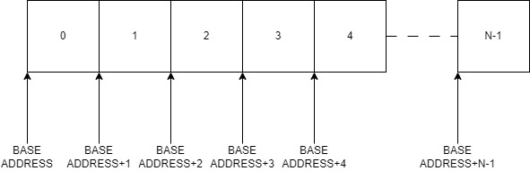
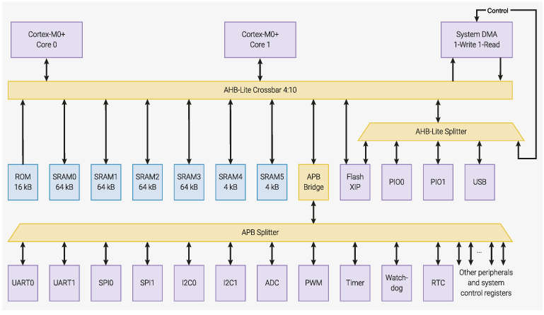
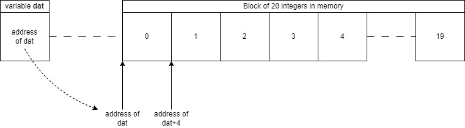

# Arrays, String and Pointers

Computer memory is often considered as a "block device" - that is a block of storage, with each element having a unique numerical address. This is depicted in the figure below:

<figure>

<figcaption>Memory can be viewed as a block of N consecutive bytes in memory with a known start address and length.</figcaption>
</figure>

Each element of memory has a unique address. The address is just a number that can be considered the location of some storage element.

In practice, computers often have multiple memory devices that together form the "memory map". Below shows the example of the Raspberry Pi Pico (RP2040). Here you can see multiple memory devices (SRAM, ROM, Flash). Note that memory is not the only type of device that has an address. 

<figure>

<figcaption>Computers often contain multiple memory devices (ROM, SRAM, DRAM) that together form part of the overall "memory map" (figure source - RP2020 Datasheet, Raspberry Pi Foundation).</figcaption>
</figure>

Within memory, two types of information are stored:

* program code
* data (variables and constants)


Program code and constants are usually stored in a memory area that is protected as read-only. 

> In some computers, such as the RP2040, this may be in "flash memory". Many devices, including modern PC architecture, have hardware mechanisms to protect program code from being overwritten.

For this section, we will focus on memory used to store our **data**, which are usually to be **variables**. This can be anything from a simple character (`char`) to a complex image. So far, we have looked at the built-in data types (`char, short, int, long, float, double`) and their variants. Each of these occupies a fixed size region of computer memory. For example:

```C++
int x;
```

On the compiler used in this course, we can say the following about the variable `x`:

* It is located in the computers "volatile" memory
* It is in an area of memory that can be written
* It occupies 4 consecutive bytes of memory (4*8 = 32 bits)
* The value stored in that memory is considered a signed whole number, with a range of -2<sup>31</sup>...+2<sup>31</sup>-1
* It will have a unique address in memory (obtained via the expression `&x`). The address is decided for us.
* Once defined, it cannot be moved or resized

What if we want to store larger and more bespoke types of information, such as text, images or tables of information? For that, we need more complex *data stuctures*, the most fundamental of which is the **array**.

## Introduction to Arrays

An array is list of `N` data values, where `N>1`. It is stored as a reserved block of memory. You would create a *statically allocated* array of `N` values as follows:

```C++
<data type> array_name[N];
```

For example, a list of 20 integers would be defined as follows:

```C++
int dat[20];
```

In this example, we can say the following:

* The array `dat` represents a block of writable memory with start address `dat`.
* The array block has space for 20 integers. This consumes `20*sizeof(int)` = 80 bytes.
* Each element of `dat` is a single integer (you could use other types)

You can write to any element in the array by **de-referencing** the array with the `[]` operator. For example:

```C++
dat[3] = 10;    //Write value 10 in the element 3 of the array
int p = dat[0]; //Read element 0 of the array, and copy the value into variable p
```

We say the array variable `dat` is a **reference type**. The variable `dat` (without any dereferencing) holds the **start address** of the array, which itself is also an integer value. In C/C++ terms, this is known as a **pointer**

<figure>

<figcaption>Array variables are actually integers that hold an address.</figcaption>
</figure>

You can see in the figure above that arrays are really split into two parts: the array variable and the data itself. 

* The array data is a reserved block of memory where the list of N data values will be stored.
* The array variable `dat` is just an integer that holds an address of that memory (so it can be found).  

> We say the array variable `dat` **points** to the block of array data, which is why it is also known as a **pointer** type.
>
> The type of the array variable is `int*`. The `*` indicates it is a pointer; the `int` tells the compiler about the type of data it points to.

## Creating, reading and writing arrays

Now lets look at how we can create arrays and use a for-loop to both read and write elements.

We will create the following array:

```C++
int nums[10]; // an array of 10 integers
```

To make this more interesting, we will also **initialise** the data with some data as follows:

```C++
int nums[] = { 0, 11, 22, 33, 44, 55, 66, 77, 88, 99, 111 };   
```

| Task | 401-static-arrays |
| - | - |
| 1. | Open the solution `Arrays Strings and Pointers.sln` in Visual Studio|
| 2. | Make `401-static-arrays`` the start up project |
| 3. | Read through the code and all the comments. Run the code to see if the output is what you expected |
| 4. | Now complete the challenge: complete the code to calculate the sum of all elements in the array. A solution is provided |
| | |

**Notes:**

* The array was declared and initialised in one line:

```C++
int nums[] = { 0, 11, 22, 33, 44, 55, 66, 77, 88, 99, 111 };
```

The length of the array was *interred* by the compiler. We could equally have written the size explicitely:

```C++
int nums[11] = { 0, 11, 22, 33, 44, 55, 66, 77, 88, 99, 111 };
```

* We saw how the `sizeof()` function is used to return the number of bytes taken up by the *array data*. 
   * This is possible because the array sized it fixed at compile time and cannot change.
   * A commonly overlooked fact is that the total memory cost of this array is this value + the space needed for the array pointer itself. You never know, this might come up in an interview :)

* We used `sizeof` to calculate the number of elements in the array as follows:

```C++
int N = sizeof(nums) / sizeof(int);
```
 * The *array variable* `nums` is just an integer that holds the address of the *array data*. We can see the value stored in the array variable by treating it just like any other integer:

 ```C++
 cout << "The start address of the array nums is " << nums << " (hex)" << endl;
 ```

* We use the `[]` operator to *de-reference* the *array variable* for both reading and writing the *array data*:

```C++
    for (unsigned int n = 0; n < N; n++) {
        int newValue = nums[n] + 1; //Read (by de-referencing) and add one    
        nums[n] = newValue; //Write into the array (again, using de-referencing)
    }
```

> The term de-referencing is sometimes confusing and you may be wondering where it comes from. 
>
> Consider the array variable `nums` used in the example above. When you read using `nums[n]`, then (logically speaking) the computer will (i) read the base address stored in `nums`; (ii) calculate the offset address (add `n*sizeof(int)`); (iii) read/write the data *value* at that address.
>
> So we start with a *reference* (another word for address), and look up a *value* in memory. This is the process of de-referencing. 
>
> Many computing languages *hide* pointers from the developer. Instead they often employ *reference types*, which ultimately encapsulate (and hide) a pointer.

### Solution

It is probably useful to look at the solution, as there are some important details to point out:

When the sum of all elements is calculated, there is potential for numerical overflow. The final result was held in a 64 bit integer variable of type `int64_t`

```C++
    int64_t sum = 0L;
    for (unsigned int n = 0; n < N; n++) {
        sum += (long)nums[n];
    }
    cout << "Sum = " << sum << endl;
```

Note the alias data-type `int64_t`.

| Experiment |
| - |
| In visual studio, hover the mouse where it says `int64_t` |
| <a title="long long">What data type is `int64_t`?</a>  |

When calculating the mean, we also have to be careful. This involves dividing the sum by `N`, which is expected to result in a fractional value. Therefore, we **must** ensure that fractional arithmetic is performed. This is done by **type casting**:

```C++
float mean = (float)sum / (float)N; //Force a floating point divide
```

| Experiment |
| - |
| Make 401-static-arrays-solution the start up project |
| Run the code, and make a note of the current mean value |
| Now Remove the type casts so that it reads `float mean = sum / N;` and run again, noting the result. |
| <a title="An integer division was performed, with the result being rounded before being copied into the variable mean">Why are the values different?</a>  |

## Explicit Data Types

You will have noted the data type `int64_t`. If you look close enough, you will discover it is an alias for type `long long`. This is because `long long` happens to be a 64-bit integer on *this particular compiler*.

Unfortunately, neither C or C++ define the size (in bytes) of the built-in data types. This is a legacy problem which is unlikely to ever change. **Never assume the size of the built in data types**.

Take a closer look, and you would likely to find this in the Microsoft C++ header files:

`#define int64_t long long`

A more complete list is provided below:

| Type | Description |
| - | - |
| `int8_t` | 8-bit integer |
| `uint8_t` | 8-bit unsigned integer |
| `int16_t` | 16-bit integer |
| `uint16_t` | 16-bit unsigned  integer |
| `int32_t` | 32-bit integer |
| `uint32_t` | 32-bit unsigned integer |
| `int64_t` | 64-bit integer |
| `uint64_t` | 64-bit unsigned integer |

All modern compilers provide these definitions.

## Strings
Strings are one of the most important and commonly used data structures in software engineering. Much of the data that is transferred over the Internet. Applications such as email and the World Wide Web (WWW) use string data as a common interchange format. Much of the data we collect is encoded in string format. Strings are incredibly important, and deserve a special study.

Strings are used for so many different purposes in computing, and that includes any type of computer system. Examples include:

* Data from an electronic module (e.g. temperature sensor, accelerometer or GPS)
* World Wide Web (WWWW) traffic (such as HTML, XML and JSON)
* Data encoded for transmission between different computers
* Display output or keyboard input

More examples do exist. You might wonder why we go to the effort to convert numbers into strings. Consider the hex value 0x12345678 stored in an integer variable. This 32-bit number is 4 bytes long.

As we have seen, memory is organised into bytes (8-bit values), so in which order are the bytes to be stored in memory?

> **It depends on the compiler and CPU design**, so it varies!
>
> How data is organised in memory is known as "endianness"

Now consider what might happen if we send a 32-bit integer number from one machine to another (via a network, serial interface or storage device). 

> If you don't know the byte order of the recipient machine, there is a real risk the received data values will be incorrectly restored (and hence become corrupted).
>
> This is a real world problem - An integer for an x86 PC has a different format to an Arm based device (such as a Raspberry Pi) 

Software that receives data from another source cannot guarantee what sort of computer created it. Equally, if you are generating data for another recipient computer to process, you may not know its type (either now or in the future!)

One popular solution is for the originator to to "marshall" the data into a common string format. The receiving end will then convert it back into it's native integer format (known as unmarshalling).

This is much safer as the recipient can convert strings into numbers using it's own (known) byte alignment. However, it comes with an overhead cost. Consider an example: 

* The HEX value 1234ABCD, which as a decimal is 4 bytes.
* Written as a human-readable string would be "1234ABCD" which is 9 ASCII characters (including the zero on the end).

So the string representation is 9 bytes instead of 4 in binary format. There is also the computational cost of converting from binary number to string and back again. However, it is so much safer and simpler that it commonly used.

In C, strings are simply an array of data stored in a simple format. The are simple and easy to understand, but also require great care to avoid introducing security vulnerabilities.

In C++, we have much more powerful (and safer) support for strings and similar to other languages and frameworks such as C#.NET and Java. We will start with looking at C strings, but for this module, but you will be encouraged to use C++ strings going forward. 

## C Strings

In C, strings are simply arrays of characters that typically form sentences or other human readable information. In the C programming language, the string is backed by an array of type `char` (8-bit characters).

> * The C-string is an array of characters with a zero on the end
> * The all-important end-of-string character is 0 (which we can write as "\0") 
> * It is not uncommon for the array to be larger than the string length

Constant strings are defined as arrays. For the unitialised string, we could write the following:

```C++
char moduleName[16]; //Holds up to 15 characters + 0 terminator
```

An initialised string can be defined as follows:

```C++
char moduleName[] = "COMP1000"; //9 characters long (NOT 8!!!)
```

The compiler can infer the size of this string. This is equivalent to:

```C++
char moduleName[] = {'C','O','M','P','1','0','0','0', 0}; //9 characters long
```

We can display a string in C or C++ as follows:

```C++
//C standard library version
printf("The module code is %s\n", moduleName);

//C++ standard library version
cout << "The module code is " << moduleName << endl;
```

**Both** of these methods **rely** on the terminating `0` to know when the string ends.

> An uninitialized  string is actually **dangerous**. It's content is random and it may not contain a zero! This would cause both `printf` and `cout` to run off the end of the array and into the memory of other variables or random values.

| TASK | 403-c-strings |
| - | - |
| 1 | [Watch this video](https://plymouth.cloud.panopto.eu/Panopto/Pages/Viewer.aspx?id=06de658e-51e4-42df-9fa7-b09800fc1db3) |
| 2 | Make the project 403-c-strings the start up project |
| 3 | Step through the code, reading the comments and the code output |

## C++ Strings

As we say in the previous section, C strings are very low level, and with that comes risk. C++ has an additional data type `string`. Backed by an array, this data type is *much* easier and safer to use.

| TASK | 405-c++strings |
| - | - |
| 1. | Make 405-c++strings the start up project |
| 2. | Step through the code, reading the comments and observing the output |
| 3. | Do you notice how much easier C++ strings are? There is no mention of terminating zeros either! |

> How come this is so much easier, and why could this not be done in C?
>
> Key to this is that C++ is an **Object Orientated** language. This allows the complexity to be hidden, making the developers job easier and safer. We will talk a lot about this in forthcoming sections, but for now, let's just experience the benefits. 

**Key Points:**

Creating a C++ string is really simple. An initialised string can be created as follows:

```C++
string moduleName = "Comp1000";
```

An uninitialised string has zero length and inherently safe.  Unlike C strings, they can be extended later

```C++
string moduleName;
moduleName = "Comp1000";
```

You still have read/write access to the individual character in a string using the same operators `[]`.

```C++
int L = (int)moduleName.length();
for (int n = 0; n < L; n++) {     
    cout << moduleName[n] << " ";
}
```

Copying a string is also simple:

```C++
string anotherModule;       //Create another string
anotherModule = moduleName; //It's that easy!
```
This performs an element by element copy for you, and there are no concerns about string length or zero terminators. With `string`, the `=` operator behaves as a value type.

String comparisons are also simple and use the familiar `==` operator (again, similar to your built in value types)

```C++
if (moduleName == anotherModule) {
    cout << "moduleName and anotherModule have the same content!" << endl;
}
```

> Advanced point - in the above two examples, `moduleName` behaves as a value type (like int, char, short etc..)
>
> It is designed to not behave as a reference type or pointer. The internal pointer is mostly hidden away

Appending strings uses the `+` operator. An example is here:

```C++
    string header;                   
    header = moduleName + " " + institutionName;
```

Searching strings is also possible. A basic example is here:

```C++
size_t loc = header.find("of");
```

We can then extract sub-strings easily:

```C++
string firstHalf = header.substr(0, loc); //From 0..loc-1
string secondHalf = header.substr(loc);   //From loc to the end

cout << "First part is " << firstHalf << endl;
cout << "Second part is " << secondHalf << endl;
```

The results look as follows:

```
First part is comp1000 University
Second part is of Plymouth
```

For marshalling numbers into strings, you can use the build in conversion functions. For example:

```C++
string strYear = "0000";
unsigned int year = 2023;
strYear = to_string(year);
```

To unmarhsall back to a native integer type, there is a function for that (as well as other types):

```C++
int parsedYear = stoi(strYear);
```

### So where is the array?
It's not as hidden as you might think. We can access the pointer, but it insists you use a `const char*` type to stop accidental modification (there are ways to break this, but why would you?).

```C++
const char* str = strYear.c_str();
```

There is much more you can do with C++ strings, and this is just an introduction. A good reference is [W3 Schools](https://www.w3schools.com/cpp/cpp_strings.asp).

| Challenge 1 | Web Scraping |
| - | - |
| 1. | Make 405-c++ strings challenge the start up project |
| - | Complete the first task |
| -  | The string `input` is a very basic web page. One of the "attributes" is a title, which is set to "42".
| - | Write some code to extract the numerical value from the `input` string |
| | |

| Challenge 2 | Word Count |
| - | - |
| - | The user is prompted to type in a sentence. |
| - | Modify this code to count the number of times the word `the` is included |
| | |


| Challenge 3 | Reversing the elements of an array |
| - | - |
|  | Starting with an array of integers, can you write some code to reverse their order? |
| (a) | For the first version, you can use a second array to hold the result |
| (b) | For the second version, try and perform this using a single array (known as in-place modification) |


## Header Files and Namespaces
We've not talked much about header files, except to say that when you uses `#include <filename>`, you essentially paste the copy of the file (name <filename>) into your code.

So first, note the following two lines:

```C++
#include <iostream>
using namespace std;
```

The header file for all the C++ standard input / output is `iostream`. 

Without the second line, we would have to prefix every `cout`, `cin` and `endl` with the prefix `std::`

> This prefix is known as a `namespace` and is a prefix designed to avoid *name collisions*.
>
> If we know which prefix to use, we can have it automatically added with the `using` directive


# DO NOT GO PAST THIS POINT

[Back to Table of Contents](./README.md)


## C String Challenge

There is a clever function in the C standard library called `strtok`. This is used to read parts of string separated by a _delimiter_, such as a comma or space.

> You can read about it here: https://linux.die.net/man/3/strtok_r

Task-159 has some starter code which takes a string, with instructions separated by commas.

* Build and step through Task-160 to see what it does

Using string functions described about, you should do the following:

Use each string to switch on a specific LED

When you find a _wait_ string, do the following:

* wait for 1s,
* then turn OFF all LEDs 

Use `strcmp` as part of your solution.


Now proceed to the next lab (see table of contents).

---

[Back to Table of Contents](./README.md)