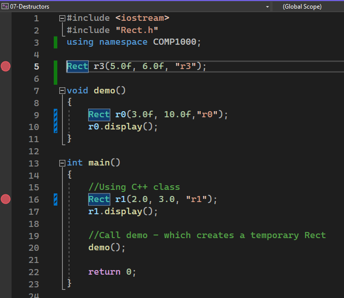

# Classes

In this session, we will look at a very important language feature of C++, that is creating and using **class types**.

**Contents**

* [Pointers and References](#pointers-and-references)
   1. [Pass by Value and Pass by Reference](#pass-by-value-and-pass-by-reference)
* [Name Spaces]()
* [Fundamentals of Classes](#fundamentals-of-classes)
   1. [Simple class type](#simple-class-type)
   1. [Constructor](#constructor)
   1. [Initialiser Lists](#initialiser-lists)
   1. [Destructors](#destructors) 
   1. [Overloading](#overloading)
   1. [Dynamically Instantiating Objects](#dynamically-instantiating-objects)
   1. [Composition](#composition)
   1. [Separating Declaration and Definition](#separating-declaration-and-definition)
* [Template Classes - a first look](#template-classes-a-first-look)
* [Some Useful Classes](#some-useful-template-classes)
* [Challenges](#challenges)

## Pointers and References

Before we embark on our exploration of classes, it would probably benefit the reader to take a closer look at two important concepts in C+, *pointers* and *references*.

> Pointers tend only to feature in C and C++. They are a very low level construct commonly used by system engineers to manipulate memory directly
>
> References are an *abstraction* of pointers, and tend to feature in most imperative languages (such as C# and Java)
>
> To really understand references in C++ (and other languages), it helps to understand pointers.

| Task 01 | 01-PointersAndReferences |
| - | - |
| 1 | Open the solution file Classes in Visual Studio 2022 |
| 2 | Make `01-PointersAndReferences` the start up project |
| 3 | Step each line, reading the comments. Pause to predict the output when prompted in the comments |

**Key Points**

[Watch this debriefing video](https://plymouth.cloud.panopto.eu/Panopto/Pages/Viewer.aspx?id=a8f11e2d-34aa-4129-8568-b0ac00e9887f) to review the main points. 

* A pointer type is just a variable that holds an address of some data in memory
   * You read and write to the memory by *de-referencing* with the \* operator
* A reference type is a variable that shares the same address with another variable
   * If you change one, you change the other

### Pass by Value and Pass by Reference

Pointers and references are commonly used to allow functions to directly modify data.

| Task | 03-PassByValueAndReference |
| - | - |
| 1. | Make `03-PassByValueAndReference` the start up program |
| 2. | Step each line, reading the comments. Pause to predict the output when prompted in the comments |

**Key Points**

In this task, we first observe passing a parameter by value:

```C++
    // Create and initialise a
    int a = 100;

    // (a) - by value - will a be affected?
    int b = addOneByValue(a);
    cout << "a = " << a << endl;
    cout << "b = " << b << endl;
```

In this case, the **value** of `a` is **copied** into the parameter `u`. At this point, `a` and `u` are entirely independent variables.

```C++
int addOneByValue(int u) {
    u = u + 1;
    return u;
}
```
As a consequence, `a` is unaffected. Constrast this with the next example:

```C++
    // (b) - by pointer - will a be affected?
    addOneByPointer(&a);
    cout << "a = " << a << endl;
```

Note how the **address** of `a` (`&a`) is copied into the parameter `pointerToU`.

```C++
void addOneByPointer(int* pointerToU) {
    *pointerToU = *pointerToU + 1;
}
```

This function then reads the value at address `pointerToU` using the re-referencing operator `*`. 

> `*pointerToU` can be thought of as "read the value at address `pointerToU``

The read value has `1` added, and the resulting *value* is copied into the memory at address `pointerToU` again using the de-referencing operator `*`.

> Note that `pointerToU = *pointerToU + 1;` would be incorrect. This would change the stored address to `101`. I've no idea what you would find at address `101`!

Finally, we can achieve the same thing with much nicer syntax by using C++ *reference types*.

```C++
    // (c) - by reference - will a be affected?
    addOneByReference(a);
    cout << "a = " << a << endl;
```

The way to interpret this is that the parameter `refToU` will hold the same address as the variable passed to it (in this case `a`).

```C++
void addOneByReference(int& refToU) {
    refToU = refToU + 1;
}
```

Therefore, by modifying `refToU`, you must also modify `a`.

Do not think this is just a `C++` feature. Most languages have reference types. Under the hood are pointers, but they are purposely hidden from view.

## Name Spaces

Something you might have noticed at the top of most examples is the following:

```C++
using namespace std;
```

To understand this, it helps to have created our own namespace. An example is shown below:

| EXPERIMENT | 02-NameSpaces |
| - | - |
| 1. | Make `02-NameSpaces` the startup project |
| 2. | Build the code, and step through with the debugger to see what it does |
| 3. | Now uncomment the line that reads `\\int x = 0;` |
| 4. | Note the error message |

Let's look at this in stages. First, the namespace declaration:

```C++
namespace COMP1000 {
int x;
int addOne(int u) {
    return u + 1;
}
```

The code within the namespace declaration looks like a variable named `x` and a function named `addOne`. However, these are not the *fully qualified names*. By enclosing them within a namespace declaration, their actual names are `COMP1000::x` and `COMP1000::addOne`.

> We say that `COMP1000` is the **scope**
> 
> The `::` is known as the scoping operator

This is done to avoid **name collisions**. In a large project, it is quite possible there will be other symbols with the name `x` or `addOne`.

These full-qualified names are using in the following code:

```C++
COMP1000::x = 20;
cout << "x = " << COMP1000::x << endl;
COMP1000::x = COMP1000::addOne(COMP1000::x);
cout << "x = " << COMP1000::x << endl;
```

It would seem reasonable to question why we bother. Afterall, we could simply use longer names, such as `COMP1000_x` or `COMP1000_addOne`, to avoid name collisions. Yes, that is possible, but there are some problems:

* Long names make code hard to read
* What if you change your mind (in 2 years time, this might be COMP1001). I will have to rename all my variables and functions.
   * Companies often use brands or product names. These can change as products and businesses evolve.
* There is even a possibility you use a library that has the same namespace (rare I admit).

To address the first point, we can *try* and infer the namespace as follows:

```C++
using namespace COMP1000;
x = addOne(x);
cout << "x = " << x << endl;
```

Note the use of the `using` keyword here.

* Beyond the `using` statement, the compiler will look for a variable `x` and `COMP1000::x`.
   * If it finds one of them, it will use it
   * If it finds both, it will not know which to use, so consider it to be ambiguous (and an error)

This is when when we added a global `x`, we got an error.

The same is true for `cout`, `cin` and `string` (etc..). All these have a prefix `std::`. However, writing this every time is tedious and clutters to code. This is why you see `using namespace std;` at the top. Of course, we need to ensure we do not create any name collisions if we do this.

## Fundamentals of Classes

Most of the code we have seen uses the *baked in* data types, including `char, short, int, long, float, double`.

We have also **used** other types, including `string`, `ofstream` and `ifstream`. We use these **custom data types** to create a special type of variable we call an **object**. 

We saw how *objects* can contain data, but also functions. For example:

```C++
string name = "The module is COMP1000";
size_t loc = name.find("module");
```

Note how object `name` (type `string`) contains data, and the function `find()` which searches that data. 

* The details of data storage and function code are **encapsulated** inside, hiding the complexity, and making the object easy and safe to use. 

* In contrast to using pure C strings, it is much easier to embed complex string processing capabilities within our own applications. Each time we use a `string`, we are effectively **reusing** code written (and tested) by others.

> Encapsulation and reuse are two core features of a very important programming paradigm, that is **Object Orientated Programming**, or **OOP**.

In this section, we will learn to **create our own custom data types** using the `class` keyword. In the next lab, we will look at some more advanced object orientated concepts.

### Simple class type

A class in it's most basic form is similar to a C structure. Consider the following structure:

```C++
struct Rect {
    float width;
    float height;
    double area;
}
```

We have now created a custom data type `Rect`. In this example it has three members: `width`, `height` and `area`. We can read and write those members. For example:

```C++
Rect r1 = {2.0, 3.0, 0.0};
r1.area = r1.width * r1.height;
```

Earlier in the course we saw how we might write functions to manipulate the members. For example:

```C++
void updateArea(Rect* this) {
    //Pointers use -> arrow notation, as opposed to . dot
    this->area = this->width * this->height;
}
```

Note how the parameter `this` is a **pointer** (address). Having access to the address of a variable means the function can overwrite that data at that address. We say that it can perform *in-place modification*. You might now do the following:

```C++
Rect r1 = {2.0, 3.0, 0.0};  //Create and initialise
updateArea(&r1);            //Pass the ADDRESS of the data
cout << r1.area << endl;    //Output is 6.0
```

**Deep down, a class is similar to a structure, only the `this` parameter is automatically provided.**

As discussed previously, the arrow-notation can be visually distracting. You can also use a C++ reference instead of a pointer.

```C++
void updateArea(Rect& ref) {
    ref.area = ref.width * ref.height;
}
```

Note how the dot-notation is used with a reference. When we invoke this, we might now do the following:

```C++
Rect r1 = {2.0, 3.0, 0.0};  //Create and initialise
updateArea(r1);             //Pass a REFERENCE of the data
cout << r1.area << endl;    //Output is 6.0
```

This works because **the parameter `ref` is a reference type, so has the same address as `r1`**.  

> An argument against this is that it is less clear from the code that `updateArea` performs in-place modification. You would simply have to "know". 

Let's now build on this example. In the next task, you will witness a class and a structure that perform the same task.

| TASK | 05-RectClass |
| - | - |
| 1. | Make 05-RectClass the start up project |
| 2. | Step through the code to see what it does |
| - | Use the step-in feature of the debugger to step into the functions. Read the comments |
| - | Note the location of each function your encounter |

There is a LOT to take in here, so let's break this down. First, let's look at the structure.

```C++
//Using C structures
Rect_t r1 = CreateRect(2.0, 3.0);
display(r1);
setHeight(r1, 10.0f);
display(r1);
```

This worked well as long as we only use the API. However, we can easily break it.

| TASK |  |
| - | - |
| 3. | Change the code above to read as follows |
| - | Build and run - notice how the area is not updated! |

```C++
//Using C structures
Rect_t r1 = CreateRect(2.0, 3.0);
display(r1);
//setHeight(r1, 10.0f);
 r1.height = 10.0;
display(r1);
```

The compiler cannot stop us doing this with structures. However, **with a class we can control access**.
Now let's look at the version with a class:

```C++
//Using C++ class
Rect r2(2.0, 3.0);
r2.display();
r2.setHeight(10.0f);
r2.display();
```

| TASK |  |
| - | - |
| 4. | Change the code above to read as follows |
| - | Try and build the code - Note any errors |

```C++
//Using C++ class
Rect r2(2.0, 3.0);
r2.display();
//r2.setHeight(10.0f);
r2.height = 10.0;
r2.display();
```

You probably got an error message similar to:

`'Rect::height': cannot access private member declared in class 'Rect'`

This error occurs because the member variable `height` cannot be accessed outside of the class. This rule is enforced by the **compiler**. To understand how this is done, we now need to look at the class declaration.

```C++
class Rect
{
//Private section - only class Rect member functions can access these
private:
    float width;
    float height;
    double area;

    void updateArea() {
        area = width * height;
    }

public:
    //Constructor - always called when a new object is created
    Rect(float w, float h) {
        this->width = w;        //We can use the this pointer
        height = h;             //Or infer it
        updateArea();
    }

    //Setter
    void setHeight(float h) {
        if (height != h) {
            height = h;
            updateArea();
        }
    }

    //Getter
    double getArea() {
        return area;
    }

    //Display utility function
    void display() {
        std::cout << "Width: " << width << ", Height: " << height << ", Area: " << area << std::endl;
    }

};
```

The **members** of this class are in an area labelled **private:**

```C++
private:
    float width;
    float height;
    double area;
    ...
```

Nothing the **private** section can be accessed from outside of the class. So back in main, the following line will not compile:

```C++
r2.height = 10.0;   //Will not work - height is private
```

A class does not just contain member data. It also contains **member functions**. These functions are part of the class, and **do** have access to the private section(s).

For example:

```C++
void setHeight(float h) {
    if (height != h) {
        height = h;
        updateArea();
    }
}
```

Note how this function is able to directly read and modify `height`? This is because `setHeight` is a **class member function of `Rect`**.

The member functions in this class include:

* `updateArea` - this is a private member function, so can only be called from another class member function.
* `display` - used to write information to the terminal
* `setHeight` - a "setter function", used to set the value of the `height` member variable (and then update the area)
* `getArea` - a "getter" function that returns a **copy** of the area member variable
* `Rect` - a special function known as a **constructor**. This will be discussed next.

All these member functions have access to all member variables and member functions in the class.

#### Relationship to `namespace`

It is also the case that a class is a *namespace* for it's members. The following code is also legal syntax:

```C++
Rect r2(2.0, 3.0);
r2.Rect::display();
r2.Rect::setHeight(10.0f);
r2.Rect::display();
```

This style is unnecessary verbose in this instance, but later we will see occasions where it is used.

### Constructor

There is a very special and important member function called a constructor. A  constructor function has the following unique properties:

* It has the same name as the class
* It has no return type

When we created a new **instance** of our class in main, it was done as follows:

```C++
Rect r2(2.0, 3.0);
```

> **Terminology**
>
> We say that `r2` is an **instance of** `Rect`. We also say `r2` is an **object**.

When this line runs, two things happen:

* Memory is allocated for a new object (to store members `height`, `width` and `area` )
* The **constructor** function is then run and given the opportunity to initialise the member variables.

The constructor function is shown below:

```C++
//Constructor - always called when a new object is created
Rect(float w, float h) {
    this->width = w;        //We can use the this pointer
    height = h;             //Or infer it
    updateArea();
}
```

In this example, two methods of writing to the member variables are shown. The address of `r2` is will stored in the pointer variable `this`. We can use this pointer to change any member variable:

```C++
this->width = w;
```

If you drop the `this->` part, the compiler will infer it. So the following line:

```C++
height = h; 
```

is really 

```C++
this->height = h; 
```

> Having the compiler infer `this->` keeps the code less cluttered. Some consider it bad practise however.

The **private** `updateArea()` member function is then called from within the constructor:

```C++
 void updateArea() {
     area = width * height;
 }
```

Again, by implication, this is equivalent to:

```C++
void updateArea() {
    this->area = this->width * this->height;
}
```

This is allowed as the constructor function is a member of the class, so can access anything in the `private` section.

> You cannot call `updateArea()` from outside the class however because it is `private`.

#### Setters and Getters

The member variable `area` is not accessible from outside the class. However, **read only** access can be provided by using a *getter function*

```C++
double getArea() {
    return area;
}
```

This function returns a **copy** of the current value of `area`. In main, we could use this as follows:

```C++
Rect r2(2.0f, 3.0f);
double a = r2.getArea();
```

Note that `a` and the internal `area` are entirely independent. We also can allow properties to be set using a **setter function**, such as the member function, `setHeight`:

```C++
void setHeight(float h) {
    if (height != h) {
        height = h;
        updateArea();
    }
}
```

Once again we infer `this->`. You might use it as follows: 

```C++
Rect r2(2.0f, 3.0f);
r2.setHeight(5.0f);
```

As `setHeight` is a public function, so it can be called from anywhere. This is called a *setter* as it is used to set a member variable. Of course, all the necessary house keeping is performed as well (updating the area in this case).

| TASK |  |
| - | - |
| 5. | The setter function for `width` is missing.  |
| - | Add another member function to the class to implement this |
| - | A solution is provided |

### Initialiser Lists

If we look at the constructor, we will see both `width` and `height` being initialised within the code body:

```C++
Rect(float w, float h) {
    this->width = w;        //We can use the this pointer
    height = h;             //Or infer it
    updateArea();
}
```

Another way to write this is with an **initialiser list** as follows:

```C++
Rect(float w, float h) : width(w), height(h) {
    //Code body
    updateArea();
}
```

The difference is subtle. 

* The `width` property is first initialised to `w`
* The `height` property is then initialised to `h`
* THEN the constructor code body is entered

In summary, initialisation lists are performed **before** the constructor runs. The significance of this will become apparent later.

### Destructors

We've met the constructor function, which is called when ever an object is created. We can also create a **destructor** that **runs when ever an object is destroyed**. To illustrate this, let's expand our `Rect` class to include some file handling.

| Experiment | 07-Destructors |
| - | - |
| 1. | Make `07-Destructors` the startup project |
| 2. | Build the code, then step through with the debugger. Use step-in to step into functions |
| Question |  <a title="When the function `demo()` exits">What causes the destructor to run for object `r0`</a> |
| Question | <a title="When we exit the main function">What causes the destructor to run for object `r1`?</a> |
| 3. | Now uncomment the line that reads `//Rect r3(5.0f, 6.0f, "r3");` |
| 4. | Set breakpoints as shown in the image below |
| Question | Which breakpoint is reached first? | 
| Question | When the code exits, which object destructor ends last? |

<figure>

<figcaption>Course Icon</figcaption>
</figure>

**Key Points**

In the `demo` function, we **statically allocated** the object `r0`

```C++
void demo() {
    Rect r0(3.0f, 10.0f,"r0");
    r0.display();
}
```

When this function is called, the following will happen:

* The memory for `r0` will be allocated (you don't see this) in an area that is dedicated to the `demo` function.
* It's constructor will run. 
   * The constructor performs all the tasks needed to initialise the object:
      * Opens a file for write
      * Initialises member variables
      * Calculates the area
* We use the object as needed
* When the function ends, `r0` goes **out of scope**
   * The destructor for `r0` is run and performs essential tasks to tidy up:
      * The file is closed
   * The memory is released and the object is **automatically** destroyed

The exact same is true to `main` and `r1`. The `main` function is like any other. Anything created between the braces `{ }` is **local** to main, so only visible within `main`. The "scope" of `r1` is limited to the `main` function. When `main` exits, so `r1` is destroyed. 

Up until now, we've assumed that `main` is the entry point to our code, but in fact it is not.

The object `r3` has **global scope**.

* It can be accessed from anywhere in your project
* It's constructor runs **before** main
* It's destructor runs **after** `main` has exit.

> Sometimes you hear the expression "code before main". This not only includes global object constructors, but includes other code needed to set up the environment in which your program will execute (mostly hidden from you).

### Overloading

In a class, we have seen you can write member functions to perform operations, including the reading and writing of private class member variables.

Some times we want to add some flexibility. For example, in our `Rect` class, we provide a width, height and filename. The filename is used to log data to a file. What if we don't always want to log data to a file? File access will slow down our code and add more files to our disk.

In most OOP languages, you have a facility known as **overloading**. This is a mechanism by which we can have different versions of the same function. What differentiates the different versions are the function parameters.

| TASK | 09-Overloading |
| - | - |
| 1. | Make `09-Overloading the start up project` |
| 2. | Build and step through the code (remember to step in, not over) |
| 3. | In particular, note that changes when different parameters are used when creating the object |

On closer inspection of the `Rect` class, we see we now have **two** constructor functions

```C++
 Rect(double w, double h, string id) {
    ...
 }

 Rect(double w, double h) {
    ...
 }
```

The compiler determines which is called based on the parameters you pass. In this case:

* if you pass a `string` as a third parameter, the object is initialised to support file logging. 
* If you only pass a width and height, no file logging is supported
* You must use one of them

|  |  |
| - | - |
| 4. | Make an overloaded version of `updateArea` that takes a new width and height as parameters. When this version is called, it should update the width and height (see below) and then recalculate the area: |
| - | `void updateArea(int w, int h)` |
| - | Make this version `public` to it can be called from main. |
| - | You should test this new function by calling it from main  |
| - | A solution is provided |

### Dynamically Instantiating Objects

So far, we've created objects in much the same way we would an ordinary variable.

```
<type> objectName[(<parameters>];
```

where the `type` is a class type.

> Note that square brackets `[ ]` are often used to denote optional items

In C++, this can be done at a global scope or (like most other languages) within some local scope, such as a function.

> A local scope is always created where ever you use a pair of curly-braces `{ }`. You can create local objects within function, for loops, while loops etc. Once you exit past the close brace `}`, the object goes **out of scope**.

For statically allocated objects, you control when they are created. They are only destroyed when they go out of scope.

For **dynamically allocated objects**, you control both when an object is created, and when it is destroyed. For this you use the `new` and `delete` keywords.

| TASK | 11-DynamicAllocation |
| - | - |
| 1. | Make `11-DynamicAllocation` the start up project |
| 2. | Once again, step through the code, reading the comments and observing the behaviour. Try and discover the answer to the following two questions: |
| Question | <a title="Line 18, when `new` is called"> Precisely when is the constructor for `r1` executed?</a> |
| Question | <a title="Line 34, when `delete r3;` is called">Precisely when is the destructor for `r1` executed?</a> |

**Key Points**

* The variable `r1` is a pointer that can store the address of an object (type `Rect`) in memory:

```C++
Rect* r1;
```
* Until this pointer is initialised, it will contain random data, so it is good practise to initialise as follows:

```C++
Rect* r1 = nullptr;
```

* At the appropriate point in our code, we attempt to create an object in memory

```C++
r1 = new Rect(3.0f, 4.0f, "dynamic");
```

* This performs the following tasks:

   * `new` requests enough memory for an object of type `Rect` 
      * If successful, the start address is returned and copied into `r1`
      * If not successful (memory full), `nullptr` (0) is returned and copied into `r1`
   * If memory allocation was successful, the constructor for `Rect` will be called.
      * This initialises the object as before
      * Note that the pointer `this` and `r1` hold the same value

* As `r1` is not the object itself, but the address of an object, we must **dereference** it using the arrow notation:

```C++
r1->display();
```

This is equivalent to the following:

```C++
(*r1).display();
```

where `r1` is the address (integer) and `*r1` is the contents of the memory at that address (an object of type `Rect`). You can also create a reference type:

```C++
Rect& r1Ref = *r1;  //One of my favourite tricks :)
r1Ref.display();
```

* Finally, when we are finished with the object, we can force it to be destroyed as follows:

```C++
delete r1;
```

* This performs the following tasks:
   * Call the destructor function
   * Free up the memory this object occupies so it can be reused

* Dynamic memory allocation is a fairly large topic, and is not something you should use unless it is required. C++ is designed to be fast, and to give the developer control so code can be highly optimised. You will discover that other languages have mechanisms to try and automate some of the above. Be aware however that all such techniques come with overheads and a performance penalty. C++ also has some libraries to bring it in line with other languages, but this is too advanced at this stage.

| ADVANCED TASK | You were warned :) |
| - | - |
| 3. | Can you change the `Rect` class so that the members `filename` and `output` stream are created dynamically? |
| - | The idea is that we only use memory for objects if we really need them |
| - | The types will need to become `string*` and `ofstream*`
| - | *This is quite a challenging and fussy task*, so only attempt if confident! |
| - | A solution is provided |

### Composition

Our `Rect` class now has the following members:

```C++
double width;
double height;
double area;
string fileName;
ofstream outputStream;
```

Note that `string` and `ofstream` are objects which have *class types*. When have objects inside other objects, this is known as **composition**.

> Our `Rect` class is benefitting from reusing all the mature and tested code encapsulated within the `string` and `ofstream` objects.

This worked easily because they all have constructors that require no parameters. If we wrote the following in the `main` function, it would be perfectly legal syntax:

```C++
int main() {
    string fileName;
    ofstream outputStream;
}
```

Some objects **require** parameters when they are constructed (they do not have parameterless constructors).

| TASK | 13-Composition |
| - | - |
| 1. | Make `13-Composition` the startup project. Build and run |
| 2. | Inspect `StringBanner.h` to see the new class that has been added. Note the constructor parameters |
| 2. | Open `Rect.h`. We are now going to add a new member of type `StringBanner` so we can use it in our code. Uncomment the line that reads |
| - | `//StringBanner banner;` |
| 3. | Try and build. Note the error message |

You cannot create an object of type `StringBanner` without passing at least one parameter (the text to display)

```C++
StringBanner banner; //Does not compile as StringBanner has no parameterless constructor
```

The constructor for `StringBanner` has two parameters.

```C++
StringBanner(string txt, char bannerCharacter = '*') {
    msg = txt;
    bannerChar = bannerCharacter;
}
```

The first must be provided. The second is optional, and will use a default value (character `*`) if not provided.

All members must be instantiated before the constructor can run. You can use an initialiser list do this:

| TASK | |
| - | - |
| 4. | Modify the constructors of `Rect` as follows |

```C++
Rect(double w, double h, string id) : banner(id) {
    banner.display();
    //Remaining code not shown for brevity
    ...
}

Rect(double w, double h) : banner("NO FILE") {
    banner.display();
    //Remaining code not shown for brevity
    ...
}
```

What this does is ensure the constructor for object `banner` is run with the required information BEFORE the `Rect` constructor is run. 

> If this were not the case, it would not be possible to invoke `banner.display()` in the constructor.

## Separating Declaration and Definition

Until now, as we create a class, it has all been written in a single header file. In C++, we have the option to split the *declaration* and the *definition* into separate files. 

| TASK | 15-SeparatingDeclarationAndDefinition | 
| - | - |
| 1. | [Watch this video](https://plymouth.cloud.panopto.eu/Panopto/Pages/Viewer.aspx?id=a328c961-7ff5-4c59-933e-b0ad00d8732d) to understand what is meant by separating declaration and definition |
| 2. | Move the definition of the function `display()` to `StringBanner.cpp` |
| - | A solution is provided |


## Template Classes (a first look)

In this section, we will take a brief look at a very powerful feature, known as templates.

Sometimes when we write a class, we find out that we want to write it again, only with different data types. Let's look at an example:

| TASK | 17-SimpleTemplateClass |
| - | - |
| 1. | Make `17-SimpleTemplateClass` the startup project |
| 2. | Look closely at the `Point` class in `Point.h` |
| 3. | Build and run the code, and check the output. Do you notice anything "misleading"? |
| 4. | In both cases, step into the constructor of each object `p1` and `p2`. Check the values that are actually passed into these functions |

`Point` was written on the assumption that only integers would be used. As long as integers are used, everything works fine.

```C++
Point p1(4, 5);
p1.display();
cout << p1.max() << endl;
```

However, the following was also allowed:

```C++
Point p2(4.0f, 4.5f);
p2.display();
cout << p2.max() << endl;
```

The two floating point values `4.0f` and `4.5f` are not integers, so they are automatically converted by rounding. This results in `p2.max()` returning a value of `4` which is very misleading!

Implicit type conversion like this is usually best avoided for these very reasons. 

One solution is to write another class `Point_f`, that uses floating point values instead. However, if you try this, you will likely find that most of the code would be identical! Luckily, C++ (and many other languages) has a facility to generate different versions of your code for data types.

In C++ this is called **templates**

| TASK |  |
| - | - |
| 5. | Now open the file `Point2.h` and look at the code. How much has actually changed? |
| 6. | In `main`, change the type of `p1` to `Point2<int>` and `p2` to `Point2<float>` |
| 7. | Build and run again |

**Key Points**

* The class `Point2` is no longer a class. It is a template for a class. Another expression might be a "blueprint".

```C++
template<class DataType>
class Point2 {
...
```

Each time you create an instance of `Point2`, you provide a concrete type for `DataType`.

For example:

```C++
Point2<int> p1(4, 5);
```

The compiler then create a new class, substituting `int` for `DataType`. If we then create another using a float:

```C++
Point2<float> p1(4.0f, 4.5f);
```

the compiler with create *another* version of the class, this time substituting `float` for `DataType`.

Now consider the member function `max`

```C++
DataType max() {
    if (x >= y) {
        return x;
    }
    else {
        return y;
    }
}
```

* The expression `(x >= y)` will ultimately be compiled to machine code. For arithmetic operations, the code that is generated will often vary significantly for different  data types.

* We have managed to **re-use** one version of our source code for multiple different data types.

At this stage, writing code in this style may seem a bit ambitious (this is a fairly advanced topic). However, it is quite likely that you will reuse template classes written by others. Hopefully, the above has given you enough insight to understand the why some of the syntax looks the way it does. 

## Some Useful Template Classes

There are a number of existing template classes that are commonly used.

* `array<T, N>` - Fixed size array of N values of type T
* `vector<T>` - Variable sized list of values of type T
* `map<T,P>` - Collectiob of "key-value" pairs, where the key used to look-up a value

| TASK | 19-UsefulTemplateClasses |
| - | - |
| 1. | Make `19-UsefulTemplateClasses` the start up project |
| 2. | Build the code, and step through, reading the comments |

This task simply provides examples. 

### vector template class

The `vector` is the one that is most commonly used and deserves some further attention. A vector is a list of values. Unlike an array, it can grow in size as more data is added. It is also a template class, so can contain different data types (even other class types). For example, to hold a list of values of type `double`, we would create the `vector` as follows:

```C++
vector<double> vec;
```

You can add a sample to the vector with the `push_back` function. For example: 

```C++
vec.push_back(1.23); 
vec.push_back(2.34); 
vec.push_back(3.45); 
```

We can read the vector as if it was an array:

```C++
double u = vec[1];  //2.34
```

We can look through a vector:

```C++
for (unsigned int n = 0; n < vec.size(); n++) {
    cout << vec[n] << endl;
    }
```

Using *modern* syntax, there is now a more concise form:

```C++
for (double x : vec) {
    cout << x << endl;
}
```

Vector is incredibly useful and there isn't the time to do it justice here.

> You are recommended to read up on examples of using `vector` as it is so pervasive.

We will meet `vector` (and others) in other examples as we proceed through the course.

# Challenges

The challenges for this lab are particularly important. There is a large gap between following lab tasks and writing your own code. You are encouraged to try all challenges. In some cases, if solution is provided, this is not THE solution as there may be multiple ways to achieve the same goals.

| Challenge 1 | 20-Challenge1-StudentRecord | 
| - | - |
| 1. | Make `20-Challenge1-StudentRecord` the start up project |
| 2. | Read through `StudentRecord.h` |
| 3. | Complete all the functions in the class |
| 4. | Add code to `main` to test the class |

In the next challenge, less is provided as a starting point. This is so you can start to practise on your own.

| Challenge 2 | 22-Challenge2-ModuleRecord |
| - | - |
| 1. | Make `22-Challenge2-ModuleRecord` the starup module |
| 2. | Open `ModuleRecord.h` - it is mostly empty! |
| 3. | Open `ModuleRecord.cpp` - it is mostly empty! |
| 4. | Complete this class to meet the requirements below |
| 5. | Optional - write all function definitions in the CPP file |
| 6. | Write code in main to test the class |

**Requirement** - The following information should be encapsulated:

* Module name (string)
* Module subject area (string, default is COMP)
* Module code (unsigned integer)
* Number of credits per semester (unsigned integer, default is 20)
* Number of semesters (unsigned integer, default is 1)

Once initialized, none of the information can be updated.

**Requirement** - The following APIs need to be created:

* `string moduleSummary()` - returns a string that describes all information about the module
* `int totalCredits()` - returns the total number of credits (Number of credits per semester multiplied by the Number of semesters)

If you have some spare time and want an advanced challenge, then try challenge 3.

| Challenge 3 | 24-Challenge3-YearRecord (advanced)|
| - | - |
| 1. | Make `24-Challenge3-YearRecord` the start up project |
| 2. | Create a class to encapsulate data about an academic year on a given program |
| 3. | Modify main to test it |

The following information should be encapsulated (minimum set):

* The number of students in the year (fixed once set)
* The number of modules in the year (fixed once set)
* An array of modules (array of type `ModuleRecord`)
* An array of students (array of type `StudentRecord`)

The following functionality needs to be added:

* Ability to add a student
* Ability to add a module
* Ability to check if a student is in the year

> Tip
>
> You can either use simple primitive arrays, or you might want to research the vector type.

---

[Back to Table of Contents](./README.md)