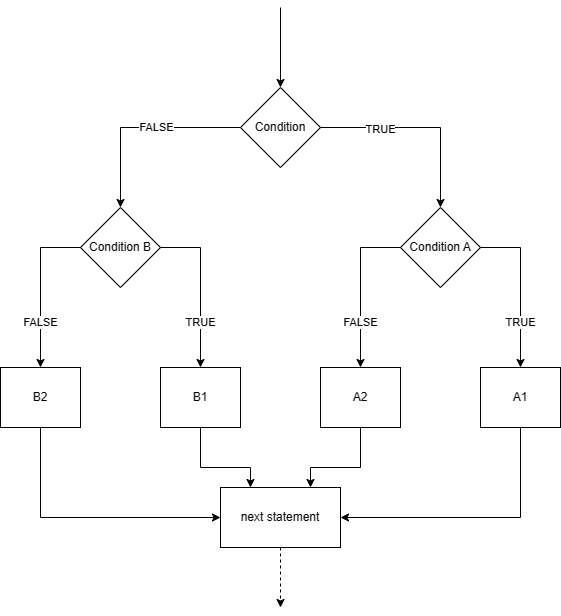
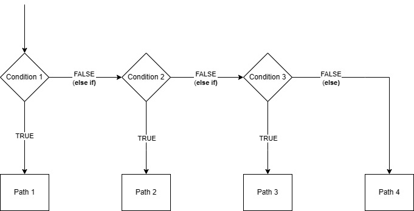

# Flow Control

We need a way to control the 'flow of execution' of our programs. We have seen this performed in the `while` and `do-while` loops. Flow control is not limited to loops however.

Deciding how to control the program flow is based on a *condition* being true. A few examples using the comparison operators:

| Condition | Value |
| :--- | :--- |
| a < b  | true if a is less than b |
| a <= b | true if a is less than or equal to b    |
| a > b  | true if a is greater than b    |
| a >= b | true if a is greater than or equal to b    |
| a == b | true if a is equal to b    |
| a != b | true if a is not equal to b    |

The `if()` statement is written like this:

```C++
if (<condition>)
{
  // execute the statements in this code block if <condition> is non-zero (true)
}
```

To enter the code block, the condition in the parenthesis must resolve to `true` (non-zero). If not true, the block is simply skipped. 

### Some C++ Input and Output

We have already seen how C++ has an alternative method to **write** to the terminal, using `cout`

```C++
   cout << "Hello World";
```

We can also **read** the keyboard input as follows:

```C++
   int someNumber;
   cin >> someNumber; //Blocks and waits for keyboard input, then attempts to convert to an integer
```

As we move towards adopting more of the C++ language, we will start using these more often.

## `if` statement
Let's now look at the simple `if` statement.

| Task | 301-if-statement |
| :--- | :--- |
|  1 | Set 301-if-statement as the Startup Project. |
| - | Run the code, then enter a value between 0 and 100 |
| 2 | Run again, this time enter a value of -10.  |
| Question | <a title="The while loop will keep repeating as long as the value is negative">What happens and why?</a> |
| 3 | Run again, this time enter a value of 100 |
| 4 | Run one more time, now enter a value of 101 |
| Question | <a title="The while loop does not consider the upper limit. This is a logical error">101 is an erroneous value. Why is it not handled correctly?</a> |
| 5 | Improve the code so that it keeps asking for user input until the value is in range. |
| 6 | Add an additional `if` statement so that when a zero is entered, "Tank is empty" is also displayed on the screen |
| 7 | Now we are going to introduce a **common error** to illustrate a point. Change `if (level == high)` to `if (level = high) ` |
| - | Note the warning in Visual Studio |
| - | Run the code and enter a level of zero |
| |  A solution is provided |
| |

Key Points:

* The `do-while` loop is performing some basic *user-validation*
* The keyboard was read with `cin`, which is commonly used in C++ (not part of C)
* Be careful when checking for equality. Use the `==` operator (and be careful not to use the `=` operator!. Never ignore warnings that apply to the code you write.)


## `if-else` statements

In the [previous task](#if-statement), we saw the following lines of code:

```C++
    if (level <= low)                       // check the level
    {
        cout << "Tank needs filling" << endl;
    }

    if (level > low)                       // monitor the level
    {
        cout << "Tank has sufficient fuel for now" << endl;
    }
```

The two outputs are **mutually exclusive**. Both cannot be true at the same time. We can consolidate this to something simpler by using `if-else` as follows:

```C++
    if (level <= low)                       // check the level
    {
        cout << "Tank needs filling" << endl;
    }
    else
    {
        cout << "Tank has sufficient fuel for now" << endl;
    }
```

Therefore, by logical inference, the second output string will be displayed if `level > low`.

| Task | 303-if-else |
| :--- | :--- |
|  1 | Make 303-if-else the start up project |
| 2 | Add an else clause to every if statement in order to perform the following |
| - | A solution is provided |

* When the tank is not empty, it should additionally display "The tank is not empty"
* When the tank is not full, it should additionally display "The tank is not full"

> **A note about layout**
>
> In the solution, two layout styles were used for the `if-else` statement. Both are acceptable.
>
> It is important to remember that you need to be able to clearly identify which code block belongs to which conditional statement. Although indentation is entirely aesthetic, it can be useful for this purpose. 

The compact for is as follows:

```C++
    if (level == high) {
        cout << "Tank is full" << endl;
    } else {
        cout << "Tank is not full" << endl;
    }
```

It is still easy to establish which code runs under the two different conditions, so as this takes less space on screen, this is actually considered favorably by some. 

## Nested `if-else`

You are not limited to just one level of conditional statement. Conditions can be nested.

> Great care needs to be exercised with this as the code can quickly become hard to write and debug

| Task | 305-nested-if-statements |
| - | - |
| 1. | Make 305-nested-if-statements the start up project |
| 2. | Run the code and try the values 0, 9, 11 and 100 |
| 3. | Step through the code to see how the nested if-statement is used to make the low-fuel condition more informative |
|  | Also note how the *end of line* constant `endl` is used to append sentences |
| 4. | Now add an additional `if` within  the `else` block (where `level>low`), indicating to the user if there is an option to top up the fuel (but only if the tank is not full) |
| - | A solution is provided |

## Mutually exclusive conditions using `else if`

I the previous examples, we used an `if-else` to separate the code into two mutually exclusive paths.

```C++
if (condition1) {
  //Code path A
} else {
  //Code path B
}
```

> We can say this **partitions** the decision space into two regions (with a hard threshold).
>
> There are other AI based techniques that try to model "softer decision making", such as "Fuzzy Logic", but this is far beyond the scope of this module. 

We can use nesting to further partition the decision paths:

```C++
if (condition) {
  //Code path A
  if (conditionA) {
    //Code path A1
  } else {
    //Code path A2
  }
} else {
  //Code path B
  if (conditionB) {
    //Code path B1
  } else {
    //Code path B2
  }
}
```

In the illustration above, we now have four mutually exclusive paths through the code {A1,A2,B1,B2}. This is depicted by the figure below:

<figure>

<figcaption>Showing 4 mutually exclusive paths through the code</figcaption>
</figure>

Although logically correct, *nesting can soon become unwieldy*. The indentation alone can begin to resemble a pyramid of code!

> As a general guideline, it is often said you should avoid more than 3 levels of nesting

For mutually exclusive paths, it is usually clearer to use the `if else-if else` structure. 

```C++
if (condition1)
{
  // Path 1
}
else if (condition2)
{
  // Path 2
}
else if (condition 3)
{
  // Path 3
}
else 
{
  // Path 4
}
```

A flow-chart depicting this is shown below:

<figure>

<figcaption>Showing 4 mutually exclusive paths through the code</figcaption>
</figure>


| Task | 307-if-elseif-else |
| - | - |
| 1. | Make 307-if-elseif-else the start up project |
| 2. | Build and run. Try values 0, 10, 11, 99 and 100 |
|  | Set a break-point and use the debugger to follow the logic of the code if you are unsure |  

The logic for the code so far is somewhat unhelpful. It is suggested that the range needs to be broken into more *fine-grained partitions* to the driver can make a better assessment of when to stop at a fuel station.

Consider the following more useful decision partitions:

| level | Output |
| - | - |
| 0 <= level <= 5 | Dangerously Low |
| 5 < level <= 30 | Low |
| 30 < level <= 70 | Medium |
| 70 < level <= 95 | High |
| 95 < level <= 100 | Full |

| Task | 307-if-elseif-else (continued) |
| - | - |
| 3. | Modify the code to produce the output for the ranges shown in the table above.  |
| | A solution is provided |
| |


## Switch statement

The switch statement is similar to `if - else if - else`. Although more limited (at least in C and C++), it is a useful alternative and performant.

In C and C++, switch-case statements are limited to testing for equality with type `int` and `char`. However, this is a common use-case.

For example:

```C++
int mySelection;
cin >> mySelection;

if (mySelection == 0) 
{
    // code block to execute if mySelection is equal to 0
} 
else if ( (mySelection == 2) || (mySelection == 3) )
{
    // code block to execute if mySelection is equal to 2 or 3
}
else if (mySelection == 10) 
{
    // code block to execute if mySelection is equal to 10
} 
else
{
    // code block to execute if mySelection is equal to any other value
}
```

The equivalent using a `switch-case` statement would be:

```C++
int mySelection;
cin >> mySelection;

switch (mySelection) //Expression is an integer or char variable
{
  case 0:
    // code block to execute if mySelection is equal to 0
    break;
  case 2: 3:
    // code block to execute if mySelection is equal to 2 or 3
    break;
  case 10:
    // code block to execute if mySelection is equal to 10
    break;
  default:
    // code block to execute if mySelection none of the above
}
```

Note the `break` keyword is **required** to avoid falling through into the next case.

| Task | 309-switch-case |
| :--- | :--- |
| 1 | Make 309-switch-case the start up project |
| 2 | Run and test the code. Try both valid and invalid options |
| 3 | Replace the `if-else if-else`  with a `switch-case` |
| - | A solution is provided |
| |

Now proceed to the next lab (see table of contents).

---

[Back to Table of Contents](./README.md)

