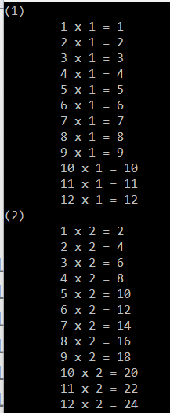

# Iteration - looping

**Note**

Remember that when using these notes and example projects, you should be working with your own **fork** of this repository. [See this video if you are unsure how to do this](https://plymouth.cloud.panopto.eu/Panopto/Pages/Viewer.aspx?id=7a58f201-2fc2-4aa5-8b77-b09100a29b9b)

Each week, you should check for *upstream* changes made my the module tutor.

* To update your personal fork, you should regularly check for **upstream** changes made by the module team. [Watch this video to see how](https://plymouth.cloud.panopto.eu/Panopto/Pages/Viewer.aspx?id=98ab1b17-f86b-4a99-be7d-b091009e0d3e)

* Whether in the lab or working from home, remember to commit and push your changes back to GitHub at the end of each work session.

## Introduction

Something a computer is very suited to it repetition. A number of terms are used for this, including:

* Looping
* Iteration
* Recursion

There are many uses for iteration and it is something that is common to almost every computer language.

> Iteration is so fundamental to computer programming, you will find that at machine code level, there are special instructions to support it.
>
> Applications that require the same set of operations to be repeated millions (or billions) of times are often very sensitive to small inefficiencies. Examples  include those used in media processing, encryption, AI and game physics. 
>
> Iteration in the C and C++ languages are easily compiled and optimised into efficient machine code, which is partly what makes them so efficient. Iteration is often a lot slower in interpreted languages such as Python and functional languages such as Haskell.

The good news is that the language syntax (programming language grammar) is almost identical in C, C++, Java and C# (to name just some examples). Many languages have syntax that derives from C. They all tend to borrow ideas from each other.

For this session, the objectives are as follows:

* Use a do-while loop to repeat a block of code until a specific condition is met
* Use a while loop to repeat a block of code until a specific condition is met
* Compare and contrast the do-while and while loops
* Use a for-loop to repeat a block of code a specific number of times
* Use the `if`, `continue` and `break` statements to change the flow of iterating code
* Create nested loops and illustrate the visibility of loop variables

## Do-While loop

In the lecture we started with the `do-while` loop. Perform the following tasks. Hover the mouse over any questions to see the answers.

| TASK | 201-dowhile-loops |
| - | - |
| 1 | Open the solution file in the folder 02 - Iteration |
| 2 | Make project 201-dowhile-loops the start up project |  
| 3 | Build, set a breakpoint and step through the code to see what it does |
| 4 | <a title="5 times">How many times does the loop repeat?</a> |
| 5 | <a title="5">What is the final value of `i` when the code exits?</a> |
| 6 | Change the initial value of the variable `i` to `6` and step through. <a title="It never repeats">What do you notice?</a> |

Let's now look at it more closely:

```C++
#include <stdio.h>

int main()
{
    int i = 0;

    printf("Start while loop\n");

    do
    {
        printf("i = %d\n", i);
        i = i + 1;              // Alternatively, write i++;
    } while (i < 5);            //Repeat if condition is met

    printf("Finished: i = %d\n", i);
}
```


**Key Points:**

1. The 'do - while loop' executes the code between the braces `{}` **at least once**. 
2. The loop condition is then used to decide whether to repeat.

| TASK |
| - |
| Now watch [this video](https://plymouth.cloud.panopto.eu/Panopto/Pages/Viewer.aspx?id=44be4830-aa25-4afa-aafa-b09000e4fc0b) summarizing the function of a do-while loop |

| Challenge |
| - |
| Modify the code to count from 5 down to zero |
| The output should appear as follows: |

```
Start while loop
i = 5
i = 4
i = 3
i = 2
i = 1
i = 0
Finished: i = -1
```

A solution is provided.

| TASK | 203-dowhile-getchar |
| - | - |
| 1. | Make 203-dowhile-getchar the start up project. Build and run. |
| - | In the terminal, type a single key and then press the return key. Note the output |
| 2. | New press the `q` key and press return, and the program should exit |
| 3. | Uncomment the line that reads `//printf("You also pressed return (ASCII %d)\n", returnKey)` and repeat |
| - | <a title="Decimal 10">What is the ASCII code for the return key?</a> |
| 4. | Now [watch the following video](https://plymouth.cloud.panopto.eu/Panopto/Pages/Viewer.aspx?id=a5816fe7-92a1-4db8-858e-b09000e7486d) to ensure you understand this fully |
| 5. | Can you modify the code so that the user can press `q` or `Q` to exit? |
| Hint | A clue is to rephrase the question in terms of the *condition to repeat the code*. Repeat the code when the user input is not a `q` **and** not a `Q`. |
| | Another way to think of it is the *condition to not exit* |
| | Those new to programming might need some time to solve this. That is to be expected. A solution is also provided |
| 6. | Now [watch the follow debrief video](https://plymouth.cloud.panopto.eu/Panopto/Pages/Viewer.aspx?id=6c895b7f-0e5b-4ac3-a35c-b09000e90883) |
| |

Remember we use the following *conditional operators* to build complex conditions.

| Operator | Meaning | Type |
| - | - | - |
| `&&` | AND | Binary |
| `\|\|` | OR | Binary |
| `!` | NOT | Unary |
| `==` | EQUALS | Binary |
| `!=` | NOT EQUALS | Binary |

Let's reflect on the task above, as it can be confusing. 

* Remember that in a do-while loop, we provide a *condition to repeat* the code.
* This is the logical opposite of the *condition to exit* the loop.

Sometimes it is more natural / intuitive to think of the exit condition instead of the repeat condition. If so, that is fine. We can easily convert one to the other.

> We can say that if `A` is the condition to *exit* the loop, then `!A` is the condition to *reenter* it.

Breaking this down:

1 First write down the condition to **exit** the loop: 

`(userEnteredCharacter == 'q') || (userEnteredCharacter == 'Q')`

2 Invert the logic to get the expression to **re-enter** the loop: 

`!( (userEnteredCharacter == 'q') || (userEnteredCharacter == 'Q') )`

### De-Morgan's Theorem

We can actually take this further and re-write the expression in another form using something known as De-Morgan's Theorem. This allows us to remove the outer `!` operator, and might result in an expression that is more natural (matter of opinion and case dependent of course).

Start with the expression we wish to transform. This will be a *binary* operator with two parameters:

`!( (userEnteredCharacter == 'q') || (userEnteredCharacter == 'Q') )`

Now apply to the following **three** steps to transform this to a logically equivalent expression:

1 Invert the whole expression (by adding or removing the NOT operator `!`)

`(userEnteredCharacter == 'q') || (userEnteredCharacter == 'Q')`

2 If the logical operator is an AND, make it an OR. If the operator is an OR, make it an AND. In this case, we transform the OR to AND:

`(userEnteredCharacter == 'q') && (userEnteredCharacter == 'Q')`

3 Finally, invert the logic of the parameters. In this case, from `==` to `!=`:

`(userEnteredCharacter != 'q') && (userEnteredCharacter != 'Q')`

So the condition to repeat the loop now reads as follows:

> "if `userEnteredCharacter` is not a `q` **and** `userEnteredCharacter` is not a `Q`, (then repeat)"

| Challenge |
| - |
| Change the code above to use this AND based logic. Run the code to check it works. |
| |

For a more formal treatment, see https://en.wikipedia.org/wiki/De_Morgan%27s_laws

We observe that with the `do while` loop, the code block (between the braces `{}`) always runs **at least once**. The sibling of this is the `while loop`, where this is not the case. We will examine this now.

## While loop

Similar is the while-loop. This was also covered in the lecture.

| TASK | 205-while-loop |
| - | - |
| 1 | Make project 205-while-loop the start up project |  
| 2 | Build, set a breakpoint and step through the code to see what it does |
| 3 | <a title="5 times">How many times does the loop repeat?</a> |
| 4 | <a title="5">What is the final value of `i` when the code exits?</a> |
| 5 | Change the initial value of the variable `i` to `6` and step through. <a title="The code in the while loop block is never run">What do you notice that is different to the do-while loop?</a> |

Let's now look at it more closely:

```C++
int main()
{
    int i = 0;

    puts("Start while loop");

    while (i < 5)
    {
        printf("i = %d\n", i);
        i++;        // same as i = i + 1 but more concise;
    }

    printf("Exiting with i=%d\n", i);
}
```

We observe that the conditional test is perform in advance of the code block:

```C++
    while (i < 5)
    {
```

as opposed to the end:

```C++
    } while (i < 5);
```

We used the less than (binary) conditional operator in this example, but there are others. Here are some more conditional operators:

| Operator | Name  |
| - | - |
| ==   |Equal to |
| !=   | Not equal         |
| >    | Greater than          |
| <    | Less than         |
| >=   | Greater than or equal to |
| <=   | Less than or equal to         |

| TASK | 205-while-loop (continued) |
| - | - |
| 6 | Modify the code to count down from 10 to 0 is steps of 2 |
| | A solution is provided |
| 7 | Now [watch this de-brief video](https://plymouth.cloud.panopto.eu/Panopto/Pages/Viewer.aspx?id=f25e602c-03e5-4b35-b6b4-b09000ef2ebc) |
| |

## For loop

The final looping construct is the 'for loop', which is a compact and (marginally) safer form of the while loop. It is especially useful when you want to repeat a block of code a number of times.

| TASK | 207-looping-N-times | 
| - | - |
| 1. | First, [watch this video](https://plymouth.cloud.panopto.eu/Panopto/Pages/Viewer.aspx?id=20878d15-7172-4c28-a32d-b09000f4935f) |
| 2. | Now make 207-looping-N-times the start up project |
| 3. | Build the code, set a break point and step through |
| 4. | Read the A-E tasks in the comments in the code attempt them all  |
| - | Solutions are provided |
| | |

The 'for loop' takes this form:

```C++
for (statement1; statement2; statement3)
{

}
```

| Statement | Action  |
| :--- | :--- |
| statement1 | Executed (once) before the execution of the code block |
| statement2 | Is the condition that must be true for the code block to execute |
| statement3 | Executes every time *after* the code block is executed |

### C99 Standard Loops

In the previous example, we used an existing variable as a loop index. Since the C99 version of the C language, a much better (and safer) alternative has been introduced.

Pre-C99, we might write a loop as follows:

```C++
int i;

for (i = 0; i < 5; i++)
{
    printf("i = %d\n", i);
}
```

Since C99, it is preferred if the variable is declared as part of the loop as follows:

```C++
for (int i = 0; i < 5; i++)
{
    printf("i = %d\n", i);
}
```

> It might be of interest that the C and C++ languages are constantly being updated, while maintaining backward compatibility where possible.

| TASK | 207-looping-N-times (continued) |
| - | - |
| 5 | [Watch this video](https://plymouth.cloud.panopto.eu/Panopto/Pages/Viewer.aspx?id=b8f5d62a-2d92-4266-9218-b09001008d4e) to see how to use C99 loops and why |
|  6 |  Change all the loops in the code to use this style (as shown in the video) |
|  |

## Break and Continue

Sometimes there is a need for finer control over how loops execute, for this we have the statements `break` and `continue`. They can be used in do-while loops, while loops and for loops.

> `break` is used to exit the current loop early. It is said to "break out" of the loop.
> 
> `continue` skips the remaining code in the code block, and re-evaluates whether to re-enter the loop.

To use this, we also meet the keyword `if` (which will be covered more formally in the next lab).


| Task | Details |
| :--- | :--- |
| 1 | [Watch this video on `break` and `continue`](https://plymouth.cloud.panopto.eu/Panopto/Pages/Viewer.aspx?id=c9d7c970-a925-49b5-9176-b091008ac106) |
|  2 | Make 209-break-continue the start up project. Build and step through as shown in the video |
| 3 | Modify the for-loop so that it loops forever until the user enters 'q' or 'Q'|
| Hint | (i) Modify the condition to enter the loop (`i <= 10`) to always be `true`; (ii) modify the `if` statement |
| | A solution is provided. Note there are many possible variants of this solution |
| |

> **Key Point**
>
> In many languages, including C and C++, whitespace or tab character have little or no meaning.
>
> However, correct indentation is often considered good practice. Some organisations will insist on it.
>
> One simple rule is as follows:
>
> * Each `{` or `}` should be on a separate line
>    * When you use `{`, the following lines should be indented
>    * When you use the matching `}`, you should move back one level of indentation. 

The example code here uses three levels of indentation. This provides important visual clues when following the flow of the code.

```C++
int main()
{
    for (int i = 0; i <= 10; i++)   // potentially loop from 1 to 10  
    {
        char c = getchar(); //Read character
        char _ = getchar(); //Read and discard newline
        if (c == 'q')          
        {
            printf("\tUser stopped the loop early at %d\n", i);
            break;                  // break out of the for loop
        }
        printf("Loop counter = %d\n", i);
    }
    puts("Done");
}

```
| Challenge | 
| :--- |
|  Amend the program such that the `printf()` statement at the end informs the user if the loop exited early or not. |
| A solution is provided. Others solutions may work of course |
| |

## Nested loops

It is possible to perform a loop inside others - this is known as **nesting**. To explain this, we will look at an example:

| Task | 211-nested-loops |
| :--- | :--- |
| 1 | Make the project 211-nested-loops the startup project |
| 2 | Set a  break point at the start of the code, and use the debugger to see how it works |
| 3 | Stop on line 13 (`printf("\tInner loop number %d\n", j)`). Now hover your mouse over the variable `i` to preview its value. Do the name for `j`. Note that both as *visible*. |
| 4 | Now stop on line 8 (`printf("Outer loop number %d\n", i)`). Do the same. |
| Question | <a title="j only exists inside the for loop in which it is declared. We say it is not in scope.">Why can you not observe the variable `j`?</a> | 
| 5 | Now create your own console application. Copy the source code from 211-nested-loops into your main.cpp | 
| 6 | In your project, add a further nested loop that increments a loop variable `k` from 1 to 3. Within this loop display values for `i`, `j` and `k` |
| | The expected output is shown below |
| | A solution is provided |

Note the use of the tab (`\t`) construct in the `printf()` function. This is the equivalent as pressing the tab key in a text editor, and is used to help layout text data in files and terminals.


```
Outer loop number 1
        Inner loop number 1
                1,1,1
                1,1,2
                1,1,3
        Inner loop number 2
                1,2,1
                1,2,2
                1,2,3
        Inner loop number 3
                1,3,1
                1,3,2
                1,3,3
        Inner loop number 4
                1,4,1
                1,4,2
etc..
```

| Challenge |
| - |
| Add column headings so that it is clear which value is i,j and k |
| See the expected output below. A solution is provided |

```
Outer loop number 1
        Inner loop number 1
                i,j,k
                -----
                1,1,1
                1,1,2
                1,1,3
        Inner loop number 2
                i,j,k
                -----
                1,2,1
                1,2,2
                1,2,3
etc...
```

| Task | Details |
| :--- | :--- |
|  7 | Modify the original task 211-nested-loops to output the classic 'times table' from early school days, the first two iterations of the output should look like this: |
| | See the solution 211-timestables if stuck |



## Note about visibility and scope 

In the previous exercise, we observed how the inner loop variable `j` was only visible within the loop itself. This is a generally a good thing. However, what if you did need access to the *last known* value of `j`?

You might be tempted to create a variable `j` as follows:

```C++
int j;
for (int i = 1; i <= 2; i++) // Outer loop 
{
    printf("Outer loop number %d\n", i);
    printf("Last known value of inner loop %d\n", j); //VERY BAD

    // Inner loop uses variable j - BAD BAD BAD BAD BAD BAD
    for (j = 1; j <= 5; j++)  
    {
        printf("\tInner loop number %d\n", j);  
    }
}
```

There is at least one error in this code!

* The line `printf("Last known value of inner loop %d\n", j)` has referenced `j` **before it was initialised**. It will contain a random value on the first pass
* The value of a loop variable is not guaranteed once the loop has exit. So it is possible that even on subsequent iterations, `j` will not contain the value you expect! Changes to the compiler settings might impact this

Again we see how indentation helps use understand the scope of variables. Scope works "inside to out" - variables at a lower level of indentation are visible; variables at a deeper level of nesting are not.

> **Interesting Note**
>
> Furthermore, using a variable in this way might negatively impact on performance. If the compiler knows `j` is only visible within the inner loop, it might be able to further enhance the machine code to produce faster and more efficient code. This is process known as **optimisation**. Using a variable with wider scope, and making reference to it in this way, will add constraints to the compiler optimisation process, with the likely impact of lower performance.

If you really need access to the last known value of j, you might consider adding an additional variable as follows:

```C++
int innerCount = 1;          // Initialise with the first known value      
for (int i = 1; i <= 2; i++) // Outer loop 
{
    printf("Outer loop number %d\n", i);
    printf("Last known value of inner loop %d\n", innerCount); //Better

    // Inner loop declared private variable j 
    for (int j = 1; j <= 5; j++)  
    {
        printf("\tInner loop number %d\n", j);  
        innerCount++;
    }
}
```

> **Advanced Point**
>
> I still have concerns with this code. Let's say I wanted to start `j` at 2. I will then have to remember to initialise `innerCount` with 2 as well.
>
> The approach here is to store this information in ONE PLACE. 

```C++
//Probably in a header file or the top of the file
#define FIRST_VALUE_OF_J 1

...
    int innerCount = FIRST_VALUE_OF_J;   // Initialise with the first known value      
    for (int i = 1; i <= 2; i++) // Outer loop 
    {
        printf("Outer loop number %d\n", i);
        printf("Last known value of inner loop %d\n", innerCount); //Better

        // Inner loop declared private variable j 
        for (int j = FIRST_VALUE_OF_J; j <= 5; j++)  
        {
            printf("\tInner loop number %d\n", j);  
            innerCount++;
        }
    }
```

If you are new to programming, don't worry if the last few points were confusing. Learning to program safely and robustly is a long process. It is why senior developers in industry might be assigned the role to supervise junior developers, and provide feedback on their coding style.

## Further Reading

You are advised to practise writing loops and look at more examples. A good tutorial can be found on the W3Schools website

https://www.w3schools.com/cpp/default.asp

There are sections on for loops, while loops and conditions.

---

[Back to contents](./README.md)