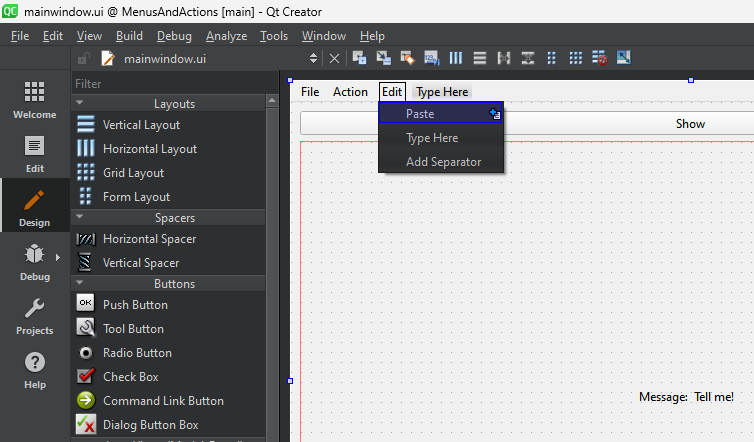

# Graphical Object Orientated Programming - with Qt

In the previous lab, we explored some Object Orientated Programming (OOP) concepts.

In this section, we can see the extensive use of this in the popular Qt Framework.

> Qt is a cross platform framework that allows you to build applications for Windows, Mac OS, Linux, Android, iOS, Web and embedded platforms.
>
> The class abstractions allow the developer to write code once, and rebuild on the platform(s) of choice.
>
> It is a good example of OOP, where you can choose between the C++ and Python languages. We will be using C++

**Contents**

* [Getting Started](#getting-started)
* [Hello World](#hello-world)
* [Hello World - Code Version](#hello-world---code-version)
* [Using the Docs](#using-the-docs)
* [Invoking other Processes](#invoking-other-processes)
   * [Launching a child process](#launching-a-child-process)
   * [Using the Clipboard](#using-the-clipboard)
* [Summary](#summary)
* [References](#references)

## Getting Started

For this task you will need Qt Creator and at least one compiler (such as the Microsoft Compiler).

[Please watch this video on installing Qt on your own machine](https://plymouth.cloud.panopto.eu/Panopto/Pages/Viewer.aspx?id=ca4ed3d5-8e3c-4e63-9a85-b0c400fbac08)

As we will be opening lab tasks in Qt Creator, watch the following video:

[VIDEO - Opening a project in Qt Creator](https://plymouth.cloud.panopto.eu/Panopto/Pages/Viewer.aspx?id=6f42fe28-f415-4476-8fd0-b0c900c85d92)

## Hello World

We start with the simplest Qt application, which comprises of a single button and a label.

| TASK | 01-Hello World |
| - | - |
| 1. | Watch the video [Hello World](https://plymouth.cloud.panopto.eu/Panopto/Pages/Viewer.aspx?id=f64471a8-1703-4554-a571-b0c900b3d38c) |
| 2. | Open the project in the `01-Hello World` folder. Build and run to confirm your system is set up correctly |
|3. | Now re-create the project yourself (as shown in the video). You may want to make reference to the video, but the more you can do yourself, the quicker you will learn |

# Hello World - Code Version

In the previous task, we saw how to create an event handler. This uses a mechanism in Qt known as "signals and slots".

> The signal-slot mechanism is a central part of the Qt framework.
>
> If you want to know more about the signal-slot mechanism, please refer to the [official documentation](https://doc.qt.io/qt-6/signalsandslots.html)
>
> If you are going to use Qt in the future, it is recommended you read this documentation.

| TASK | 02-Hello World in Code|
| - | - |
| 1. | Watch the video [Hello World in Code](https://plymouth.cloud.panopto.eu/Panopto/Pages/Viewer.aspx?id=f64471a8-1703-4554-a571-b0c900b3d38c) |
| 2. | Open the project in the folder `02-HelloWorld In Code` |
| 3. | Use the `connect` function to set up the signal-slot event handler (as shown in the video) |
| 4. | Drag in a second button below the first |
| 5. | Create a slot for the clicked event which sets the label text to "May the Force be With You |
| 6. | Connect the `clicked` signal from the second button to the slot. |
| - | A solution is provided |

# Using the Docs

In this task, you are going to complete a program. The UI has been designed for you, but the signal-slot connections have not yet been made.

The completed application should update one of the labels when the slider is **moved**. 

[A video demonstration is shown here](https://plymouth.cloud.panopto.eu/Panopto/Pages/Viewer.aspx?id=4c13bbc5-199b-4204-bb15-b0c900ed0cb8)

To connect the slider, you will again use the `connect` function.

```C++
connect(<source object>, <signal>, <target object>, <target slot>)
```

* The source object is the horizontal slider
* The signal must be emited when the slider **moves**
* The target object is the current instance of `MainWindow`
* The target slot is a function with a name of your choosing, but the parameter and return types must match the signal

<figure>

<figcaption>Single slider and label exercise</figcaption>
</figure>

You will use the Qt Creator IDE and documentation to find both the object names and the relevant signal. 

| TASK | 03-Using the Docs|
| - | - |
| 1. | Open the project in the folder `03-UsingTheDocs` |
| 2. | Notes the names of the horizontal slider and the label you are to modify |
| 3. | Select the horizontal slider, and press F1 to see the documentation. Now identify the correct signal name and parameter types |
| 4. | In `MainWindow.h`, add the correct slot declaration (under where it says `private slots:`) |
| 5. | In `MainWindow.cpp`, write the slot function |
| 6. | In the constructor for `MainWindow`, use the `connect` function to set up the signal-slot connection using code |
| - | A solution is provided |

## Menus and Actions

In this task, we will create an application menu. Menu items also emit signals when triggered (clicked on).

| TASK | 04-MenusAndActions |
| - | - |
| 1. | [Watch this video](https://plymouth.cloud.panopto.eu/Panopto/Pages/Viewer.aspx?id=01e6db92-e4e5-4136-91d9-b0c9011bf58e) to see how to add menus and connect up signals and slots |
| 2. | Open the project in the folder `04-MenusAndActions`. Build and run, now test the Show button and the "Wise Saying" menu item (as shown in the video) |
| 3. | Add another menu item "Edit", and then an action "Paste" (as shown below) |

<figure>

<figcaption>Course Icon</figcaption>
</figure>

| | |
| - | - |
| 4. | Connect the Paste action to a slot. This slot should update the string with the content of the clipboard |

At the top of your `MainWindow.cpp`, you should add the following:

```C++
#include <QClipboard>
```

In your slot, use the following to obtain the string data on the clipboard and update the label:

```C++
QString str = QApplication::clipboard()->text();
if (!str.isEmpty()) {
    ui->labelMessage->setText(str);
}
```

Don't forget to connect the menu action signal to your slot (member function). As before, put this code in the constructor of `MainWindow`.

| | |
| - | - |
| 4. | When you run your code, be sure to copy some text to the clipboard first. |
| - | A solution is provided | 


## Invoking other Processes

By now, you will see how Qt gets you a user interface, but you might also note that this results in a mixture of UI code and program logic. Often we want to separate program logic and UI (what we call separation of concerns). For example, we might want to re-use another application installed on our computer.

Luckily, Qt has a generic solution for this. In the next task, we will look at an application that find where other programs are saved.

> **Experiment**
>
> If on Microsoft Windows, open a command prompt and type the following:
>
> `where.exe notepad.exe`
>
> This will tell you where the program `notepad.exe` is located on your disk (you might have more than one!). If on Mac OS or Linux, open a terminal and type the following:
> 
> `which ls`
> 
> This will tell you where the application `ls` is stored on the disk. Again, the `which` command is used on Unix-like systems to locate an application.

Both of these applications write to the file stream `stdout` (by default, the terminal). Error messages might also be written to the file stream `stderr`. 

Your application is able to launch these as a **child process**, allow them to run and capture their output(s).

| TASK | 05-InvokingOtherProcesses |
| - | - |
| 1. | Open the project in the folder `05-InvokingOtherProcesses` |
| 2. | Build and run the code |
| 3. | If on Windows, in the next box, type `xcopy.exe` then click the Locate button |
| - | If on Linux or Mac OS, type `cp` then click the Locate button |
| 4. | Click the Edit menu, then click "Copy Result" |
| 5. | Open a text editor and paste to test |
| 6. | Read the comments in `MainWindow.cpp` to try and understand how this works |
| 7. | Complete the application to match what is shown in [this video](https://plymouth.cloud.panopto.eu/Panopto/Pages/Viewer.aspx?id=3a56ca79-cb20-42c1-8a41-b0c901183bf4) |
| -  | A solution is provided |  

**Key Points**

* Our Qt program has launched another, in this case `where.exe` in the case of Windows, or `which` on other systems
   * These are both applications that are bundled with the operating system, so we can reply on them being installed
   * Our program was also able to capture both `stdout` and `stderr`
* When you get one application to launch another in this way and capture it's output, this is a form of **Inter Process Communication (IPC)**
   * You application is known as the parent application
   * The application you launch is the child application
   * A parent application is able to capture the standard output of a child. When you run applications from a terminal, this is how the terminal is able to capture the output. The same applies to visual studio.
* By calling another application from our own, we have been able to leverage the functionality of that application
   * It means we can *separate concerns* - the GUI application can focus on GUI tasks and does not need much logic
   * It does rely on the child application also being installed and in the executable path
   * We also need to be careful about keeping versions of the two applications compatible

Let's look at some key sections of code:

### Launching a child process

When the button is clicked, the `pushButtonClicked` slot is invoked. Let's look at the first few lines:

```C++
    void MainWindow::pushButtonClicked()
    {
        QProcess process;
    #ifdef Q_OS_WINDOWS
        QString program = "where.exe";
    #else
        QString program = "which";
    #endif
        //Get command parameters
        QString app = ui->lineEdit->text();
        QStringList arguments = {app};

        //Launch child process and block until completed (should be very quick)
        process.start(program, arguments);
        process.waitForStarted();
        process.waitForFinished();
        ...
```

* The only code that differs between Windows and the others is the name of the child process we wish to launch

```C++
    #ifdef Q_OS_WINDOWS
        QString program = "where.exe";
    #else
        QString program = "which";
    #endif
```

The pre-processor directive `#ifdef` works at compile-time. In other words, it is used to modify **the source code** being built. The constant `Q_OS_WINDOWS` is defined only for the Windows version of Qt. As a consequence:

   * On Windows, the line `QString program = "where.exe";` is compiled
   * On others, the line `QString program = "which";` is compiled

* Qt tends to favour it's own `QString` over the regular `std::string` class to improve cross-platform compatibility.
* The cross-platform functionality for opening a child process is encapsulated in the `QProcess` class. It has the following key member functions:

   * `start` - launches a child process, passing command line parameters. This runs **in parallel** to the parent, sometimes on a separate CPU core.
   * `waitForStarted()` will block the parent from running further code until the child process has fully launched. We should not attempt to read any output until the application has launched.
   * `waitForFinished` will block the parent from running further code until the child process has exit. In our case, this makes sense as `where.exe` (or `which`) is very fast
 

* We then read the output of the child process as follows:

```C++    
        QString output = process.readAllStandardOutput();
        QString error = process.readAllStandardError();
```

* Again, the `QProcess` class allows us to perform the same fundamental operation on Windows, Mac OS and Linux without changing the source code.

* The UI is updated
   * Text labels are updated with `stdout` and `stderr` of the child process
   * We also enable/disable the copy menu depending on whether a non-empty result was obtained 

```C++
        //Update UI with results
        ui->label->setText(output);
        ui->label_2->setText(error);

        //Only enable the copy menu item if stdout is not empty
        if (!output.isEmpty()) {
            this->filePath = output;
            ui->actionCopy_Result->setEnabled(true);
        } else {
            ui->actionCopy_Result->setEnabled(false);
        }
    }
```

### Using the Clipboard

* In the event handler (slot) for the `Copy Results` menu item, we are able to copy the last good output to the operating system clip-board.

```C++
    void MainWindow::copyResult()
    {
        QApplication::clipboard()->setText(this->filePath);
    }
```

* Note that the following two header files were also needed:

```C++
    #include <QProcess>
    #include <QClipboard>
```

# Summary

Although there is a lot more to know about the Qt framework, hopefully this was a good insight into a real-world use of OOP. Put simply, it makes it possible to write *clean* cross platform code so that it can be built on at least three operating systems without modification.

Key to this is abstraction through encapsulation, whereby the complex details of specific operations are hidden from view.

Qt must have accumulated millions of development hours involving thousands of developers since it's inception (1995 was the first release). We are benefiting by **reusing** the class libraries and tooling to rapidly produce applications with sophisticated graphical user interfaces.


# References

[[1] VIDEO - Install Qt for Windows](https://plymouth.cloud.panopto.eu/Panopto/Pages/Viewer.aspx?id=ca4ed3d5-8e3c-4e63-9a85-b0c400fbac08)

[[2] VIDEO - Running and testing console applications from the terminal with Qt Creator](https://plymouth.cloud.panopto.eu/Panopto/Pages/Viewer.aspx?id=113dd382-5956-4d2f-9ab5-b0c400fd8d84)

[[3] VIDEO - Opening a Qt Project](https://plymouth.cloud.panopto.eu/Panopto/Pages/Viewer.aspx?id=6f42fe28-f415-4476-8fd0-b0c900c85d92)

[[4] VIDEO - Qt 101 - Hello World](https://plymouth.cloud.panopto.eu/Panopto/Pages/Viewer.aspx?id=f64471a8-1703-4554-a571-b0c900b3d38c)

[[5] VIDEO - Qt 102 - Hello World in Code](https://plymouth.cloud.panopto.eu/Panopto/Pages/Viewer.aspx?id=3eb8d6fe-376c-471a-b00a-b0c900c4cada)

[[6] VIDEO - Menus and Actions](https://plymouth.cloud.panopto.eu/Panopto/Pages/Viewer.aspx?id=01e6db92-e4e5-4136-91d9-b0c9011bf58e)

[[6] Qt Signals and Slots (official documentation)](https://doc.qt.io/qt-6/signalsandslots.html)

[[7] Qt Meta Object Compiler (official documentation)](https://doc.qt.io/qt-6/moc.html)

