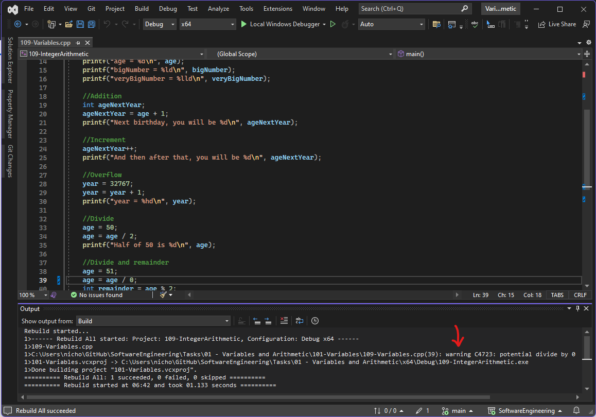

# Variables and Arithmetic

**Note**

Remember that when using these notes and example projects, you should be working with your own **fork** of this repository. [See this video if you are unsure how to do this](https://plymouth.cloud.panopto.eu/Panopto/Pages/Viewer.aspx?id=7a58f201-2fc2-4aa5-8b77-b09100a29b9b)

Each week, you should check for *upstream* changes made my the module tutor.

* To update your personal fork, you should regularly check for **upstream** changes made by the module team. [Watch this video to see how](https://plymouth.cloud.panopto.eu/Panopto/Pages/Viewer.aspx?id=98ab1b17-f86b-4a99-be7d-b091009e0d3e)

* Whether in the lab or working from home, remember to commit and push your changes back to GitHub at the end of each work session.

## Introduction

This session, the objective as follows:

* Store data in local and global variables
* Display variables in the terminal
* Read data from the terminal intput (keyboard) and store
* Use the debugger to inspect and change variable values
* Perform basic arithmetic

## Perspective
If this is your first time programming, do not be surprised if you struggle with some of the content in this lab. You may notice that it takes you longer than others. This is absolutely fine.

> Learning to program is a long game, and is sometimes compared to learning a spoken language. It *needs* time and a lot of practice. You might even say brain neurons need time to prune and connect, so give your brain time to assimilate, and be kind to yourself if you are struggling.

It is quite normal to struggle. Get what you can from these labs. Getting lots of sleep helps. 

Even by the end of the course, the expectation in a programming job would be that you are still a *junior developer*.

## Writing to the Console

Without input or output, a computer cannot fulfill a useful function.

> Philosophically speaking, is a computer actually a computer if it has no input or output? Discuss<sup>**</sup> (max. 2000 words)

> **<sub>Only joking. If you ever hear me ask for an essay, assume I have been abducted by aliens and replaced with a extra-terrestrial imitation.<sub> 

So it is that we cannot begin to learn a programming language without some form of input and output.

### HelloWorld with `puts` (put string)

In this task, we will learn to do two things:

* Open, build and run a lab project  
* Write "strings" to the terminal

| TASK | HelloWorld-101 |
| - | - |
| 1. | [Watch this video to see how to open, build and run the HelloWorld-101 task](https://plymouth.cloud.panopto.eu/Panopto/Pages/Viewer.aspx?id=f1e24e85-5947-476d-8451-b08900ebf4e8) |
| 2. | Replicate what you saw in the video |
| 3. | Modify the code such that the output reads as follows: |
| - | A solution is provided |


```
**********
Hello World
***********
```

### Writing to the Console with `printf` (print formatted)

One of the most well known *functions* you get with C (and C++) is the `printf` function.

| TASK | 103-WritingToTheConsole |
| - | - |
| 1. | Make `103-WritingToTheConsole` the startup project |
| 2.  | Set a breakpoint on line 6 and step through the code, observing what each line does |
| (a) | In the line that reads `printf("Hello Everyone. We are using C\nHow are things?\n")`, remove the \n characters and run the code again. What does this do? |
| | <p title="It removes the line breaks">Hover over this to see the answer</p> |
| | Now put the `\n` characters back |
| (b) | Use `printf` to display the value of the variable `area`. |
| - | Note that `area` is type `float`, so you will need the %f placeholder |
| - | Referring to the lecture slides, modify this to only display 3 decimal places |
| (c) |  Using `printf`, display the radius and the area using a **single** `printf` statement |
| - | Hint: use more than one place holder |
| 3. | Now look at the solution and read the code and comments |


### Writing to the Console with `cout` (C++)

So far, we have only looked at code from the C language and "standard library"

> A library is a collection of pre-written code that you can reuse in your own projects. `printf` is part of the "Standard C library"

The language C++ is a **superset** of C. What we mean is that is contains all the C language elements, and adds some more. To keep things simple, we want to avoid C++ until later in the module, but as a *sneak peek*, let's look at how C++ helps us write to the terminal output

| EXPERIMENT | 105-WritingToTheConsoleWithC++ |
| - | - |
| 1. | Make 105-WritingToTheConsoleWithC++ the startup project. |
| - | Read the code. Use the debugger to step through the code to see what each line does |
| - | Do not worry if you find it confusing. Many people prefer to stick with `printf`!

The C++ streams (as they are known) are not something we will use except in very simple cases. There is a lot to unpack to understand them, and we are not there yet.

### Reading from the console with `getchar` (read a character)

We have looked at some basic terminal output using `puts`, `printf` and `cout`. Let's not look at how we might receive input via the keyboard.

The simplest function of all is `getchar()`

| TASK | 107-ReadingTheKeyboardWithGetChar |
| - | - |
| 1. | [Watch this video first](https://plymouth.cloud.panopto.eu/Panopto/Pages/Viewer.aspx?id=447a0c2f-9cda-4e14-9357-b08900fd7152) |
| 2. | Build and step through this project as shown in the video. This is good practice using the debugger |
| | |

In the video we met the *function* `getchar()`. Specifically, we saw these lines:

```C++
char c = 0;
```

This creates a variable named `c`. It's **type** is char, which means it can store whole numbers in the range -128..127. It is typically used to store ASCII characters.

This line both reserves the memory storage, but also assigns the value zero in the same line.

> We say that `c` is initialised with the literal value 0

We could equally have written this:

```C++
char c;
c = 0;
```

The first line allocates (reserves) the memory. The second line performs an **assignment with the = operator**.

> Assignments with the `=` operator are always performed right to left. 
>
> * The expression on the right hand side is first evaluated (very simple in this case). 
> 
> * The result is then copied from right to left, in this case, setting the value of `c`.

In this case, we set `c` to a constant numerical value (known as literal constant). It does not have to be a constant value however. We can also set values that are calculated when the code runs. We see this below:

```C++
c = getchar();
```

Once again, the right-hand-side is evaluated first. In this case, the function `getchar()` is invoked. 

When this function completes, the function is said to **return a value**. This is the ASCII code of the character typed in. This value is then copied into the variable `c`.

> This is similar to how a pocket calculator works. For example, when you press the number 9, then you press the *square root* button, the square root **function** is called. This calculates and **returns** the result 3. This result can then be used for the next part of the calculation. 

Once we have the value stored in `c`, we can use it in our code. In this case, we write a string:

```C++
printf("You typed %c\n", c);
printf("This has ASCII code %d\n", c);
```

* The first line uses `printf` to **convert** the ASCII code 42 into it's equivalent character (`*`) and display it.
* The second line simply displays it as a number (42)

> Note that `printf` placeholders often perform conversions 

## Integers and Arithmetic

Integers are the formal name for "decimal whole numbers", that is, numbers without a decimal point. The word "decimal" refers to base 10 (popular, as we typically have ten toes :).

| EXPERIMENT | 109-IntegerArithmetic |
| - | - |
| 1. | Make 109-IntegerArithmetic the startup project. |
| 2. | Set a breakpoint on the first line. Then step through the code line by line |
| | For each `printf` statement, can you predict the output? |
| 3. | When finished, repeat the experiment, only with some changes: |
|  | On the first line that reads `age = age / 2;`, change the 2 to 0 |
|  | Carefully inspect the compiler output (see figure below). Look for any *warnings* |
| 4. | Using the debugger, step over this line. What happens? |
| | |

<figure>

<figcaption>Showing the Compiler Output</figcaption>
</figure>

> A bit of mathematics
>
> As far as the microprocessor is concerned, you cannot divide a number by zero and expect to get a numerical result. In the case of 50 / 0, the result would be *infinity*. Infinity is not a numerical result (more on this later).

In step 4 above, you will have witnessed a **run-time crash**. Dividing an integer by zero causes the CPU to detect an error condition, and your program is terminated as it occurs.

> The say that an error has been **thrown**  


When we wrote `age = age / 0` in the code, surely this was obvious? Well, actually it was spotted. If you looked at the compiler output you would have seen the following warning:

```
101-Variables\109-Variables.cpp(34): warning C4723: potential divide by 0
```

The warnings were there all along!

> As a general rule, you should never ignore compiler warnings

This is one of the benefits of using *compiled languages*. When the compiler converts your code to machine code, it is checking both the rules (known as *syntax*) and looking for potential *logical errors*. We will meet more warnings and errors as we progress

> **Note**
>
> Because we ignored the warning, in this case we ended up with a run-time crash, resulting in the program terminating prematurely. This is clearly not a favorable thing to occur. However, in this case, the compiler was able to warn us. Not all errors can be detected, but it does what it can.
>
> Interpreted languages such as Python and JavaScript have no compiler, so as a general rule, you discover errors at run-time. You need additional tools to help you *look* for common errors.

**Question**
In the example above, there were some lines that read as follows:

```C++
	year = 32767;
	year = year + 1;
```

However, the result was `-32768`. You might have wondered why this is? This is known as a numerical *overflow*. Not an error as such, but a practical reality of using integer arithmetic on a computer.

> The **datatype** of `year` is `short`, which on this compiler is a 16-bit value. The maximum value of short is `32767`. If add 1 to this, it will "wrap around" to the most negative value (`-32768`).

This is discussed more in the next section.

## Signed and Unsigned

Integer variables are fixed in size, so we can always calculate how much computer memory they consume. Given this fixed size, they therefore have a finite number of values that can be represented. For example, the `char` data type is stored in the computer memory as an 8-bit binary number.

For example, the decimal value 10 is represented as `00001010` in binary. That is 8 + 2. This occupies 1 byte of computer memory.

Binary is fundamentally no different to decimal, you just have less symbols (`0` and `1`). Usually we write in decimal. For example, the value 123 is

| 1000 | 100 | 10 | 1 |
| - | - | - | - |
| 0 | 1 | 2 | 3 |

Note the column headings. So we have 1x100 + 2x10 + 3x1 = 123. Binary is no different, it's just that the column headings are powers of 2 and not 10. So the value of 10 will actually be stored as follows:

| 128 | 64 | 32 | 16 | 8 | 4 | 2 | 1 | 
| - | - | - | - | - | - | - | - |
| 0 | 0 | 0 | 0 | 1 | 0 | 1 | 0 |

This is 1x8 + 1x2 = 10 (decimal). Binary is used as it represents the underlying digital electronics that makes up your microprocessor. `1` is sometimes referred to as `ON` and `0` as `OFF`. Computer memory storage is made up of (commonly) billions of single binary storage elements, each of which can be `ON` or `OFF`. It's a long story and I promise not to mention it too often :) 

> **Question**:
>
> Using the calculator on your computer, what is the decimal equivalent of binary `11111111` ?
> 
> <p title="255">Hover over this text to see the answer</p>

Given there are 8 binary digits, and each must be a `1` or `0` (on or off in an electronic sense), then there are 2<sup>8</sup> = 256 combinations. In other words, the humble `char` datatype can only represent 256 different values.

Larger data types consume more memory, but have a greater range. In the case of the example above, the variable `year` was of type `short`. This type consumes 2 bytes of data, so has 16 bits of information. It can represent 2<sup>16</sup>=65536 different values. So why did it overflow at 32767?

The answer is that `short` is signed. It can also represent negative values. In fact, all signed data types work like this. Some of the 65536 combinations are allocated to negative values, and some to positive.

> If we write the keyword `unsigned` before an integer type, it only holds positive values.

A summary is shown in the table below:

| Type | Size (bits) | Min | Max |
| - | - | - | - |
| char | 8 | -127 | 128 |
| unsigned char | 8 | 0 | 255 |
| short | 16 | -32768 | 32767 |
| unsigned short | 16 | 0 | 65535 |

| TASK | 109-IntegerArithmetic (continued) |
| - | - |
| 5. | Continuing with 109-IntegerArithmetic, change the data type of `data` to `unsigned short`. Also modify the `printf` statement to use the unsigned `%u` placeholder (see below). Build the code with ctrl-B and check for compiler warnings |
| 6. | Now run the code and check the output. Is it correct? |

```c++
	//Overflow
	year = 32767;
	year = year + 1;
	printf("year = %u\n", year);
```

| TASK | 109-IntegerArithmetic (continued) |
| - | - |
| 7. | Now set year to the value 65535. Repeat the experiment. |
| - | Is the output correct? |
| 8. | Now set the year to the value 65536. Build with CTRL-B and check the warnings. |

In the last step above, you should have seen a warning. It was possible for the compiler to spot this error as the literal constant 65536 is out of range for an `unsigned short` variable.

This can quickly become a confusing topic, and there is a lot more that can be said about the distinction between `signed` and `unsigned` values. For now, the main advice is **always check for compiler warnings** and be very careful, whatever language you are using.

## Unary Operators

In both C and C++, arithmetic can be performed using the standard mathematical operators:

| Operator | Meaning |
| - | - |
| + | Add |
| - | Subtract |
| * | Multiply |
| / | Divide |
| % | Modulus (remainder of a division) |

So for example:

```C++
int a = 2;
int y = 3;
y = y + b;
```

For the last line, the right hand side is evaluated in the following order:

1. read `y` from memory - hold in a temporary area
1. read `b` from memory - hold in a temporary area
1. add together to form a temporary result. 
1. Copy the result into the variable `y`. 

Therefore the value if `y` is 5.

The expression `y+b` is using the `+` operator as a **binary operator**, that is, an operator with two parameters (one on the left, one on the right).

> Consider the `+` operator to have two operands (left and right), which are summed to form a temporary result
 
There are also **unary operators**. We could write the code above as follows:

```C++
int y = 2;
int y += 3;
```

In this case, the line that reads `int y += 3` adds three to the current value.

## Shift Operators

As C and C++ are considered *system languages*, they have a facility to perform quite low-level operations. We will look at a few of these now:

The following operators are used to shift the position of binary digits in an integer:

| Operator | Meaning | Type |
| - | - | - |
| << | Shift left | Binary |
| >> | Shift right | Binary |
| <<= | Shift left | Unary |
| >>= | Shift right | Unary |

To explain this, an example is given:

| TASK | 111-shiftingbits |
| - | - |
| 1. | Make 111-shiftingbits the start up project |
| 2. | Setting a break point at the start of the code, step through observing the code and the corresponding output. |
| - | Can you see how the binary bits change position? |
| 3. | Complete the tasks outlined in the source code. |
| -  | What do you notice about the output? |
| | <p title="The least significant bit is lost">Hover here to see the answer</p> | 

## Using `sizeof`

There are more *integer* data types in the C and C++ languages. The list is as follows:

| Signed Type | Unsigned type |
| - | - |
| char | unsigned char |
| short | unsigned short |
| int | unsigned int |
| long | unsigned long |
| long long | unsigned long long |

Now here is the bad news:

> Apart from char, the size of the data types are not standardized. It varies with each compiler.

The good news is that you can find out using the `sizeof` function.

| TASK | 113-sizeof |
| - | - |
| 1. | Set the 111-sizeof project as the start up project |
| 2. | Read through the code. Build and run to see the output |
| 3. | Complete the code to display the size (in bytes) of all the integer data types |
| 4. | What do you notice about the size of `long` and `integer`? |
| 5. | You can also pass variables into `sizeof`. Add the following line and see what it does |
| | `printf("The size of variable sillyBigPositiveValue is %llu\n", sizeof(sillyBigPositiveValue));` |
| | A solution is provided |

> **note**
>
> You could add the prefix `unsigned` to all the integer variables. It would not change the size. All it would do is impact on the way certain arithmetic is performed. 

## Floating Point Arithmetic
One of the great strengths of computers is to perform highly intensive and fast mathematical operations. Applications include AI, data science, games, graphics programming and data encryption (just to name a few).

Most mathematics is not integer based, but requires the use of fractional numbers. If you want to perform mathematics with fractional numbers (that have decimal points), then you will probably want to use the `float` and `double` data types.

| EXPERIMENT | 115-floatingpoint |
| - | - |
| 1. | Make 115-floatingpoint the startup project |
| 2. | Set a break point on the first line |
| 3. | Step through the code, observing the corresponding output |
| 4. | Note anything unusual |
| - | - |

**Key points:**

* Both `float` and `double` have finite precision. We saw that the value `0.123456789` was not stored in a `float` without error.
* As numbers become very large, this is traded for precision. So although 0.123456789123456789 can be represented by `double` to 17 decimal places, 10000000000.123456789 was only accurate to 7 decimal places.

Finally, let's look at that last line!

```C++
x = x / 0.0;      //Error!!!!????
printf("x = %f\n", x);
```

Unlike integers, this did not crash. Instead we for the result `inf`, which represents *infinity*. If you add the following afterwards:

```C++
x = x + 1;
printf("x = %f\n", x);
```

you get the same result. Indeed, infinity + 1 = infinity. The **floating point** standard reserves a internal mechanism to handle infinity.

If you write this:

```C++
    x = 0.0;
    x = x / 0.0;
    printf("x = %f\n", x);
```

you will get the result `nan`. This stands for "not a number". There is no single definition for the result of 0.0/0.0. Another long story which I will refrain from telling :)

> Mathematical Curiosity
>
> Did you know that infinity is indeed not a number? It is actually a *limit* (a mathematical concept). The rules for limits are not the same for numbers.
>
> If you have not done a level-3 mathematics course, then it is unlikely you would have been taught this. Don't worry, I don't plan to mention it again, but you might see this in your code

It is also worth noting that much of the above is true for other languages, including `C#` and `Java`. 

## Type casting

Sometimes you will want to force a change in variable type. This is known as **type casting**. To illustrate why you might do this, consider the following example:

```C++
int main()
{
	//Read the terminal input
	unsigned char c = 0b10101100;
	displayAndCompare(c);

	//Shift left 56 bits and store in a 64bit variable
	unsigned long long x = c << 56;
	displayAndCompare(x);
}
```

The expected output is 	`10101100 00000000 00000000 00000000 00000000 00000000 00000000 00000000` (spaces added for clarity).

| EXPERIMENT | 117-typecasting |
| - | - |
| 1. | Make 117-typecasting the startup project |
| 2. | Set a breakpoint, then step through the code checking the output |
| 3. | The final result is incorrect. Why? |
| - | <p title="Because you cannot shift a variable of type char 56 places. It is too small">Hover over here to see the solution</p> |

The problem is in this line:

```C++
unsigned long long x = c << 56;
```

The left hand side of the expression is fine, as `unsigned long long` is 64 bits wide, so large enough to hold the result. However, *the right hand side of the expression overflows before it can be copied into the left*. This is because the variable `c` is only type char. 

| EXPERIMENT | 117-typecasting |
| - | - |
| 4. | Change the line as follows and run again |

```C++
unsigned long long x = (unsigned long long)c << 56;
```

This uses a **typecast**. Before the bit shift is performed, value of `c` is stored into temporary location of type unsigned long long (64-bits wide). This can then be shifted safely without overflow.

Sometimes we convert integers into floating point numbers. This was shown in the following code section:

```C++
int p = 123;
int q = 2;
double y = p / q;
printf("y = %f\n", y);
```

Note the result is rounded because we used an integer divide. We can correct this by typecasting the integers into doubles before the calculation is performed:

```C++
int p = 123;
int q = 2;
double y = (double)x / (double)q;
```

This ensures that a fractional divide is performed, rather than an integer. Now we see a full precision result.

> You might wonder why we would choose integers over floating point numbers? 
>
> There are many answers, some of which include performance, storage and application. Some algorithms are inherently integer based, such as those used in compression and encryption. Your input and output data might be integer. Pixels in an image are an example of this. If you want to transform an image (e.g. blur, or colour enhance), you might use a mixture of integer and floating point arithmetic.

## The `&` operator

Variables do the following:

* Reserve space in memory at a chosen *location*
* Store *values* in that memory location
* Provide us with a meaningful name so we can make reference to it

We need to make the distinction between two key concepts:

* **address** - this is an integer value, and it represents the *location* of the data in the computer memory. In C and C++, it is always an integer value. 
   * You sometimes hear the term **reference** in other languages. Hidden within this, there must always be an address, even if it is hidden.
 * **value** - this is the data itself. This is what is stored in the memory at a given address.

Sometimes, we need to know or provide the address of a variable. We can obtain this using the `&` operator. Watch the following video for an explanation:

| TASK | 119-lookingatmemory |
| - | - |
| 1. | [Watch this video first](https://plymouth.cloud.panopto.eu/Panopto/Pages/Viewer.aspx?id=085eab9e-3880-48be-99da-b08a00c4152d) |
| 2. | Build and run 119-lookingatmemory and repeat what was shown in the video |
| - | - |

### Reading the keyboard with `scanf` (scan formatted)

As a final task, let's look at another way to read information into the computer. We will use the modern (safer) version of the `scanf` function called `scanf_s`

| TASK | 121-scanf |
| - | - |
| 1. | Make 121-scanf the startup project |
| 2. | Build and run and try entering the following: |
| -  | The number 21 |
| - | The number 2.5 |
| - | Three spaces followed by the number 100 |
| - | 123 Hello |
| - | Hello 123 |
| 3. | Modify the code to read in an additional number and display it on the screen |
| 4. | Now write some code to calculate the average of the two values entered, then display the result on the screen |
| | |

Let's look at some of the specifics more closely. The important part of this lab is the following line:

```C++
int found = scanf_s("%d", &x);
```

* The first parameter is the *format string*. Similar to `printf`, this tells `scanf_s` what types of information to look for and convert to a numerical value.
* The second parameter is **where** to save the result. For this, we give the function the **address** of the variable. This allows `scan_s` to overwrite the variable `x`` on our behalf.

This is sometimes called *passing by reference*.

# Stretch Tasks

If you want to know more about operators and arithmetic, then [watch this video](https://plymouth.cloud.panopto.eu/Panopto/Pages/Viewer.aspx?id=a04f917b-82a1-41a6-a6f5-b08a00fdf897).

I would suggest this video is aimed at those with more experience. The slides will be made available as well. 

---

Next Week - Flow Control


